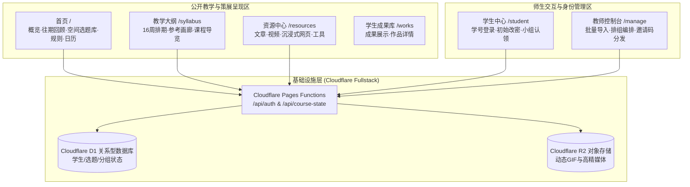

# 《内容与策展》课程总网站 · 总体架构与系统梳理

> **项目定位**：中国美术学院《内容与策展》（2026）官方全栈教学平台与数字策展系统。  
> **设计哲学**：以“可阅读、可逐层进入的策展图纸”为核心语言，采用方向性叙事、边缘色签索引与三列编辑版式，呈现冷静、精确、克制的档案感与技术手册气质。

---

## 目录索引 (Contents)

- [一、 网站系统全景图](#一-网站系统全景图)
- [二、 核心页面与功能模块梳理](#二-核心页面与功能模块梳理)
- [三、 视觉与交互设计规范](#三-视觉与交互设计规范)
- [四、 全栈技术架构与数据流](#四-全栈技术架构与数据流)
- [五、 目录结构与代码组织规范](#五-目录结构与代码组织规范)
- [六、 师生协同与权限管理机制](#六-师生协同与权限管理机制)
- [七、 本地开发与全栈部署运维](#七-本地开发与全栈部署运维)

---

## 一、 网站系统全景图



---

## 二、 核心页面与功能模块梳理

### 1. 课程主页 (`/`)
* **教学概览 (Overview)**：展示课程大纲概述、学期元数据与教学团队信息。
* **往期回顾 (Retrospective)**：历年教学与展览档案，集成交互式全屏展览详情弹窗 (`ExhibitionDetail`)。
* **空间选题与选词库 (Main / Spatial Controller)**：
  * 结合 16 组选题关键词与三维/空间载体模型。
  * 动态读取 Cloudflare D1 状态，实时呈现各空间当前选词与占用情况。
* **选课规则与日历 (Rules & Calendar)**：课程考核机制说明与 16 周动态排期日历。
* **边缘色签导航 (`HomeEdgeNav`)**：桌面端右侧 90° 旋转色签索引，支持视口感知与精准平滑锚点定位。

### 2. 教学大纲 (`/syllabus`)
* **16 周教学进程总览**：分阶段展示课件、教学重点、课后任务与交付节点。
* **参考画廊 (CourseReferenceGallery)**：精选策展案例图版与 WebP 图像证据，支持多图浏览与展开阅读。
* **受保护资源入口 (ProtectedResourceLink)**：无缝关联课件与受限资料。

### 3. 课程资源中心 (`/resources`)
* **四维媒介分类路由**：
  * `/resources/articles`：精选理论文献与学术文章。
  * `/resources/videos`：讲座录像、教学视频与示范。
  * `/resources/websites`：策展网站与数字化工具，支持**沉浸式背景色**与来源域名预览卡片 (`WebResourceCard`)。
  * `/resources/tools`：策展实用软件、辅助脚本与工具链。
* **多维筛选与灯箱**：
  * `ResourceFilterBar`：支持按分类、关键词、媒体标签即时联动过滤。
  * `ImageLightbox`：高清图版灯箱，支持大图细节缩放与手势交互。

### 4. 成果展示库 (`/works` & `/works/:id`)
* 归档历届与当期学生的策展提案、空间模型渲染图及策展方案手册。

---

## 三、 视觉与交互设计规范

遵循 [Design.md](Design.md) 确立的“图纸与手册”视觉规范：

1. **三列阅读版式 (桌面端)**：
   * **索引列 (1–2 份)**：页码、章节、状态标签或边缘窄色签。
   * **主内容列 (5–7 份)**：叙事正文、大纲排期或作品主图像。
   * **注释列 (2–3 份)**：术语释义、操作提示、参考来源与外链证据。
2. **色彩与语义系统**：
   * **底色与基线**：纯白 `#FFFFFF` 背景 + 近黑 `#111111` 正文字体，辅以 `#8C8C88` 弱分隔线。
   * **固定语义强调色**：蓝 (`#78A2ED`)、黄 (`#F2EF78`)、橙红 (`#F05A2A`)、绿 (`#2FAF87`)、洋红 (`#DE67B5`)、米灰 (`#D8D5BD`)，用于标记分类与状态。
3. **克制动效**：160–260ms 轻量过渡，杜绝通用商业化的大圆角、深阴影、渐变光晕与浮夸动效。

---

## 四、 全栈技术架构与数据流

```text
┌─────────────────────────────────────────────────────────────┐
│                      前端 (Vue 3 + Vite)                     │
│  - 状态管理与数据缓存 (useCourseState, useAuthSession)         │
│  - 响应式组件与路由控制 (Vue Router 4 + ScrollToTop)          │
└──────────────────────────────┬──────────────────────────────┘
                               │ HTTPS / JSON API
┌──────────────────────────────▼──────────────────────────────┐
│            Cloudflare Pages Functions (Edge API)            │
│  - /api/course-state : 实时选题、词库与空间状态分发           │
│  - /api/auth/session : 师生鉴权、密码哈希比对与 Session 签发    │
└──────────────────────────────┬──────────────────────────────┘
                               │
┌──────────────────────────────▼──────────────────────────────┐
│                  存储层 (Cloudflare D1 & R2)                │
│  - D1 SQLite Database : 学生账号、分组映射、选题记录          │
│  - R2 Object Storage  : 高清 GIF 动画与大尺寸多媒体资源       │
└─────────────────────────────────────────────────────────────┘
```

---

## 五、 目录结构与代码组织规范

```text
课程总网站/
├── functions/                    # Cloudflare Pages Functions 后端 API
│   └── api/
│       ├── auth/                 # 身份验证接口 (login, session, password)
│       └── course-state.js       # 课程实时状态分发
├── migrations/                   # D1 数据库 SQL 迁移文件 (表结构与种子数据)
├── public/                       # 静态发布资产 (WebP 图像、图标、字体)
├── source-assets/                # 设计与生成源文件 (AI/SVG/原始档案)
├── src/
│   ├── components/
│   │   ├── common/               # 基础通用组件 (ExternalSitePreview 等)
│   │   ├── navigation/           # 导航组件 (HomeEdgeNav, HomeSiteNav)
│   │   ├── home/                 # 首页各 Section 组合模块
│   │   ├── syllabus/             # 课程大纲、画廊与受保护资源组件
│   │   ├── resources/            # 资源中心 (Card, FilterBar, Lightbox, Shell)
│   │   └── exhibition/           # 展览弹窗与成果详情组件
│   ├── composables/              # Vue 3 逻辑复用 (Auth, Filter, State)
│   ├── data/                     # 课程静态数据、导航条目与资源字典
│   ├── router/                   # 路由配置与动态重定向
│   ├── services/                 # 前端 API 交互层与错误容灾
│   ├── styles/                   # 全局样式与排版变量
│   └── views/                    # 路由顶层视图 (Home, Syllabus, Resources...)
├── scripts/                      # 自动化热区/排期生成脚本
├── wrangler.jsonc                # Cloudflare Pages & D1 部署绑定配置
└── AGENTS.md                     # AI Agent 开发规范与交互约定
```

---

## 六、 师生协同与权限管理机制

### 教师管理端 (`/manage`)
* **批量录入**：支持直接粘贴 Excel 的“学号、姓名”创建学生账号。
* **分组逻辑**：支持手动指定小组或为小组生成一次性/限额（3人）共享邀请码。
* **状态总览**：实时查看各组选题词汇认领进度与空间分配。

### 学生端 (`/student`)
* **安全凭证**：初始密码为学号后六位，采用 Pepper + SHA-256 加密存储，首次登录可修改或跳过。
* **组队协同**：凭邀请码加入小组，支持独立退出与重组。

---

## 七、 本地开发与全栈部署运维

### 1. 本地环境启动

```bash
# 依赖安装
npm install

# 启动前端开发服务器 (Vite)
npm run dev

# 编译生产包
npm run build
```

### 2. 数据库迁移 (Cloudflare D1)

```bash
# 本地测试数据库迁移
npm run d1:migrate:local

# 生产环境远程数据库迁移
npm run d1:migrate:remote
```

### 3. 全栈本地仿真调试 (Wrangler)

```bash
npx wrangler pages dev dist \
  --d1 DB=YOUR_D1_DATABASE_ID \
  --binding ADMIN_PASSWORD=本地教师口令 \
  --binding STUDENT_PASSWORD_PEPPER=本地测试密钥
```

如果当前机器无法运行 Wrangler 的文件监听，可使用内置轻量模拟服务检查资源管理流程。它会启动一个内存 D1/R2，不会写入线上数据，重启后内容会清空：

```bash
npm run build
npm run simulate
```

然后访问 `http://localhost:8788/manage/resources`，教师口令默认为 `REDACTED`，也可以通过 `ADMIN_PASSWORD` 环境变量覆盖。

### 4. Git 工作流与持续部署 (CI/CD)

- **分支模型**：`main` 分支对应线上生产。
- **自动触发**：推送至 GitHub (`git push origin main`) 将自动触发 Cloudflare Pages 流水线进行编译、优化与全球边缘节点部署。

### 5. 资源投稿与图片存储

资源投稿使用 Cloudflare Turnstile。前端构建变量需要设置 `VITE_TURNSTILE_SITE_KEY`，Pages Functions 需要设置 `TURNSTILE_SECRET_KEY`；生产环境建议另设 `SUBMISSION_RATE_LIMIT_SECRET` 作为投稿限流哈希密钥。教师资源管理页可直接录入并上传快照/封面，图片通过 `RESOURCE_IMAGES` R2 绑定保存，当前绑定的 bucket 名称为 `caa`。

上线前请先执行一次 `npm run d1:migrate:remote`，并确认 Cloudflare Pages 项目已绑定同名 R2 bucket。未配置 Turnstile 或 R2 时，静态资源页面仍可浏览，投稿或图片上传会显示对应配置提示。

本地 `npm run simulate` 会在 `localhost:8788` 使用模拟 Turnstile，便于直接检查投稿流程；正式环境仍必须配置真实的 `VITE_TURNSTILE_SITE_KEY` 与 `TURNSTILE_SECRET_KEY`。
