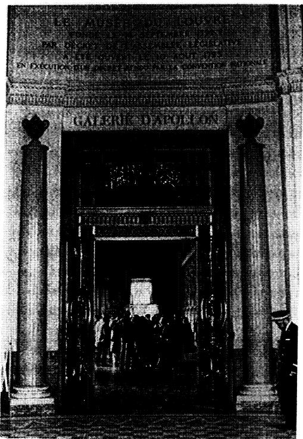
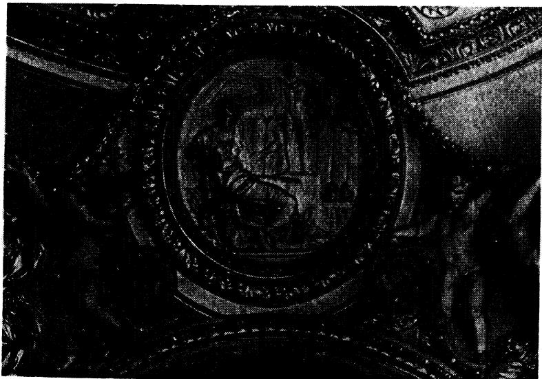
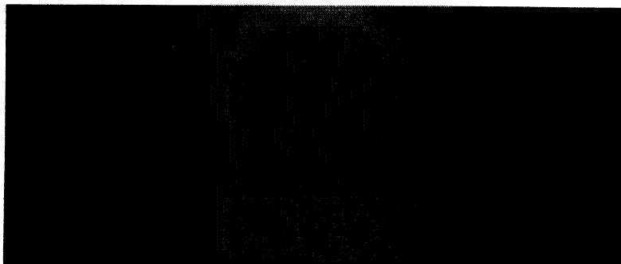
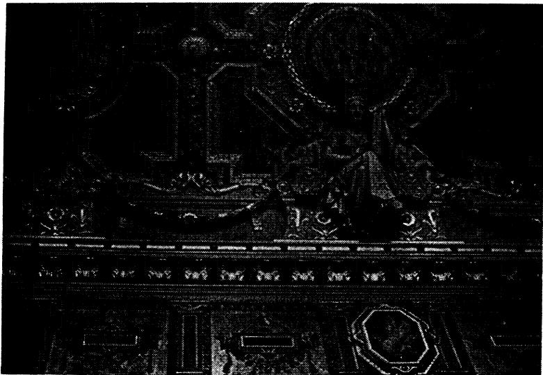
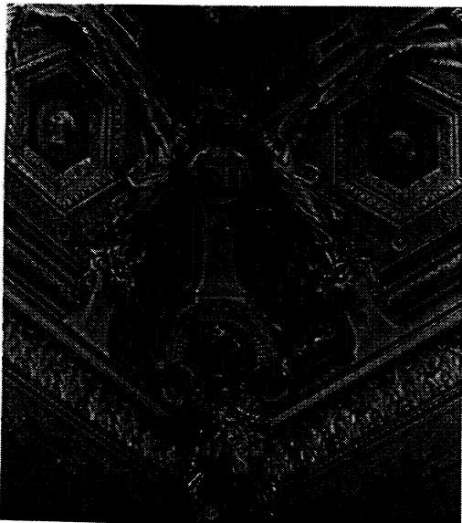
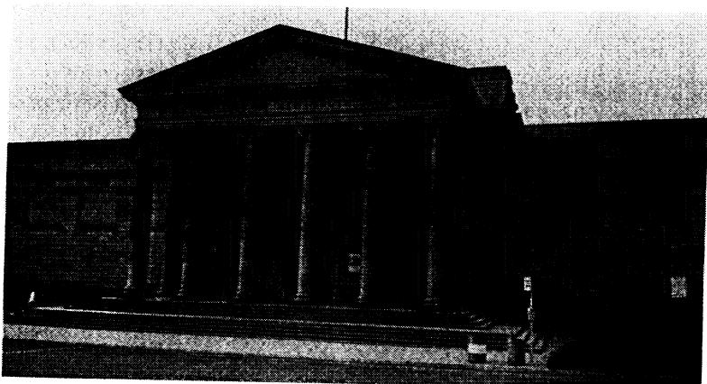
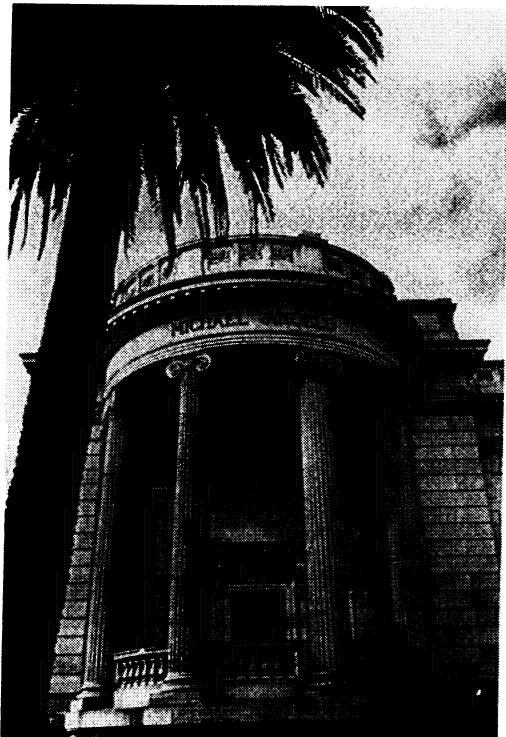
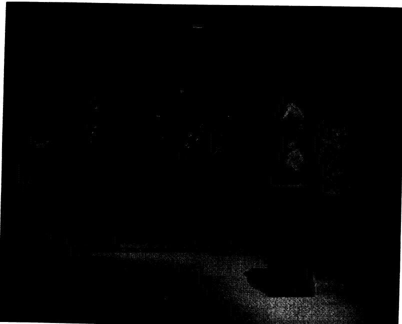

第六章

# 美术馆与公民仪式

**卡罗尔·邓肯（Carol Duncan）**

法国大革命将卢浮宫指定为国家博物馆，从而创造了第一座真正意义上的现代艺术博物馆。将旧皇家宫殿改建为法兰西共和国博物馆，曾是法国革命政府议程上的重要议题。当时，公共艺术博物馆已被视为政治美德的明证，标志着政府正在为人民提供应有的福祉。在法国之外，受过教育的公众也逐渐认识到：艺术博物馆既能展示一个国家或市政当局的善治，也能彰显其卓越公民的公共责任感与公民意识。到了十九世纪中叶，几乎每个西方国家都以拥有国家级博物馆或美术馆为荣。甚至华盛顿特区也曾一度计划在如今的伦威克大楼（Renwick Building）设立一座国家美术馆——该建筑于1859年设计，其构思在极大程度上借鉴了卢浮宫的建筑语言。

因此，西方社会早就深知：公共艺术博物馆是一个装备精良的国家重要且必不可少的制度设施。这种认知近年来也传播到了世界其他地区。近来，无论是所谓欠发达国家的传统君主，还是第三世界的军事独裁者，都对其深深着迷。西式艺术博物馆如今被用作向西方发出信号的手段——表明自己是一个可靠的政治盟友，对西方的符号与价值观心怀敬意并恪守不渝。通过提供一层政治风险极低、花费相对较小的西方自由主义虚饰，第三世界的艺术博物馆能够让西方确信：向其提供经济或军事援助是一笔安全的投资。

因此在1975年，伊梅尔达·马科斯（Imelda Marcos）在短短数周内就拼凑出了一座现代艺术博物馆。[^1] 这一仓促之举是由于国际货币基金组织（IMF）即将在马尼拉召开会议。新建的马尼拉大都会博物馆——专门展示美国和欧洲艺术——显然是为了给与会的诸多显赫贵宾留下深刻印象，其中就包括世界上最具权势的银行家们。[^2] 不出所料，新博物馆在文化层面上精确重演了在经济与军事上将菲律宾紧紧捆绑在美国之上的依附关系。它的开幕展汇集了来自布鲁克林博物馆、洛杉矶郡立艺术博物馆（LACMA）以及阿尔芒·哈默（Armand Hammer）与内森·卡明斯（Nathan Cummings）私人收藏的数十件借展作品。[^3] 考虑到华盛顿在菲律宾军事预算中的巨额资助，完全可以合理推断，这座由废弃军用建筑改建而成的博物馆大楼本身，实质上就是一份来自美国的赠礼。

伊朗国王同样需要西式博物馆来完善他为西方视线所构筑的现代化门面。德黑兰当代艺术博物馆于1977年开馆，不久后巴列维政权便轰然倒台。[^4] 这座耗资超过700万美元的多层现代风格建筑中，主要陈列着二战后时期的美国艺术品——据称价值高达3000万美元——且馆内工作人员大多是美国人或受过美式训练的博物馆专业人员。据曾任该馆首席策展人的罗伯特·霍布斯（Robert Hobbs）所述，王室仅仅将该博物馆及其藏品视为众多政治宣传工具之一。[^5]

与此同时，在西方世界内部，“博物馆热”依然未有消退。报纸几乎每周都在报道伦敦、巴黎、纽约、洛杉矶或其他国家及区域中心城市筹建新馆、扩建或翻新旧馆的宏大计划。拥有一座规模更大、品质更优的艺术博物馆，一如既往地被视作政治美德与国家认同的标志——表明自己是现代自由国家文明共同体中无可置疑的一员。

近年来，人们对西方博物馆如何再现其他文化投以极大关注——探讨博物馆对“原始”、第三世界或非西方艺术的展示，如何经常为了根本上的政治目的而误读甚至虚构异质文化。然而，在探讨“博物馆对其他文化做了什么”时，往往忽略了我认为更为前置的一个根本问题：**博物馆在我们自身的文化中究竟服务于何种根本目的？它们又是如何利用艺术品来实现这些目的的？** 因此，本文所关注的并非对外国或非西方文化的再现，而是艺术博物馆对我们自身文化说了什么、关于我们自身文化阐释了什么——即它们生产了何种政治意义，以及它们是如何生产这些意义的。我需要立即说明，我所探讨的是最为人熟知的那类公共艺术博物馆，即那些致力于呈现宏大艺术通史的典型首都或大都市博物馆。卢浮宫正是此类博物馆的原型范本。

## 作为仪式的博物馆

在本文中，我将艺术博物馆视为**仪式性纪念建筑（Ceremonial Monuments）**。我的这一总体路径源于我过去的研究，其中许多是与艾伦·瓦拉赫（Alan Wallach）合作展开的。[^6] 将博物馆称为仪式性纪念建筑，我的意图在于强调**博物馆体验本身就是一项具有纪念碑性的文化创造**，一种远超出我们过去所理解的“博物馆建筑”范畴的文化人造物。最重要的是，博物馆绝非它通常所宣称的那种中立、透明的庇护性空间。更类似于博物馆建筑经常仿效的传统仪式纪念建筑——古典神庙、中世纪大教堂、文艺复兴宫殿——博物馆是一种由建筑空间、艺术品的编排展示以及高度理性化的陈列实践所共同构成的复合体验。正如过去的仪式结构一样，博物馆在履行其所宣称的职能（保存和展示艺术品）的同时，也在执行着广泛且往往不那么显而易见的政治与意识形态任务。

自启蒙运动以来，我们的社会便确立了宗教与世俗之间的分野。我们通常认为教堂和神庙是宗教场所，在本质上不同于博物馆、法院或州议会大厦等世俗场所。我们将不同类型的真理与不同类型的场所联系在一起。这种源于启蒙运动反抗宗教教条权威的区分，将宗教真理视为一种主观信仰的范畴；而属于博物馆、大学或法庭的真理，则宣称自身对理性是不证自明的、根植于经验的且可经由实证检验的。按照这一传统，我们认为宗教真理是针对特定自愿信徒群体的，而世俗真理则享有客观或普遍知识的地位，并在我们的社会中充当更高阶、更具权威性的真理。因此，它有助于将整个共同体凝聚为一个公民机体，确认其最高价值、最自豪的历史记忆与最真实的真理。艺术博物馆坚实地属于这一世俗知识领域——不仅因为馆内所实践的科学与人文学科分支（文物保护、艺术史、考古学），更因为它们作为共同体文化遗产守护者的崇高地位。

相比之下，我们对“仪式”的概念通常与宗教实践、真实或象征性的牺牲，抑或精神蜕变联系在一起。显然，这类事件似乎与博物馆这样一个世俗场所扯不上什么关系。但是，正如当今人类学家所指出的，我们所谓世俗的文化中其实充斥着仪式性的情境与事件。[^7] 一旦我们认清启蒙话语的意识形态属性，并对世俗性所作出的宣称（即其真理是明晰的、可通过理性论证的且客观的）提出质疑，我们就可以开始概念化世俗仪式中隐蔽（或者用“伪装”更为贴切）的仪式内容。我们也可以进一步审视一种被当作世俗、因而被视为客观中立事件的仪式所具有的独特优势。

博物馆本身的建筑语言就暗示了其作为世俗仪式的特性。在长达两百年的时间里，神庙立面一直是公共艺术博物馆最流行的象征符号，这绝非偶然。[^8] 神庙立面的优势在于它能够同时唤起世俗与仪式的双重联想。博物馆建筑的起源可以追溯到希腊和罗马建筑形式逐渐成为鲜明的公民与世俗建筑通用语言的时代。古典风格的建筑指向一个拥有高度发达公民制度的前基督教世界，因而能够极好地传达世俗与启蒙原则及诉求。然而，宏伟的古典形式同时也带来了**仪式空间**——尺度适合列队巡游的走廊，以及为供奉令人敬畏、力量强大的造像而设计的内部圣所。

博物馆不仅在建筑上与神庙形似，其运作机制也如同神庙、圣殿等纪念物一样。今天的博物馆参观者与这些古老场所的访客一样，都带着一种进入某种特殊接纳状态的意愿与能力。与传统仪式场所相似，博物馆空间被精心划定并被文化赋予特殊定义，专门保留给一种特定的沉思与学习体验，并要求一种特殊的专注品质——即维克多·特纳（Victor Turner）所称的**“阈限性”（Liminality）**。[^9]

在所有仪式场所中，总会发生某种形式的“表演”。访客可能目睹一场戏剧——通常是真实或象征性的祭献——或聆听文本的诵读与特定的音乐；他们也可能亲自完成一场表演，往往是独自一人，沿着规定的路线前行，重复某种祈祷或特定文本，重温与该场所有关的叙事，或参与某种与该场所的历史或意义相关的结构化体验。某些人可能比其他人更懂得如何使用仪式场所；他们在教育层面准备得更充分，因而能对场所中的象征符号线索作出更敏锐的回应。仪式通常被视为具有转化力量的机制：它通过牺牲、磨砺或启蒙，赋予人身份认同、净化心灵，或为世界重构秩序。

因此，来到博物馆的参观者正是沿着一条路线穿行于一套被编排好的叙事之中——在此情境下，这套叙事便是某种版本的艺术史。在博物馆内部，艺术史取代了真实历史，它涤荡了历史中的社会与政治冲突，并将其提纯为一系列（主要是关于个体天才的）胜利凯歌。当然，博物馆所呈现的共同体历史、信仰与身份，可能仅仅代表了共同体内部某些权力阶层的利益与自我形象。然而，这种虚饰丝毫不会削弱纪念建筑作为仪式结构的实际效力。

## 公共美术馆的政治学

我现在想回到文章开篇提出的问题，即公共艺术博物馆的政治效用。回顾一段博物馆史将有助于把这一政治用途聚焦清楚。

专门用于积聚和展示珍宝的礼仪场所可以追溯到远古时代。人们很容易将博物馆的概念向历史深处延伸，并在古代神庙的宝库、中世纪大教堂的圣器室，或是意大利巴洛克教堂的家族礼拜堂中发现类似博物馆的功能。然而，无论公共艺术博物馆作为一种结构化体验与这些古老场所有多么相似，从历史上看，现代博物馆制度最直接脱胎于十六和十七世纪的**贵族王公收藏（Princely Collections）**。这些收藏通常陈列在专门为其建造的装潢奢华的长廊（Galleries）中，预示了后来博物馆的部分功能。从十八世纪开始，公共艺术博物馆将吸收、发展并转化王公画廊的核心功能。[^10]

通常，王公画廊被用作接待大厅，为官方礼仪提供华丽的背景，并为君主的形象提供宏伟的构框。各地的君主在这些画廊中布置他们的珍宝，旨在通过其璀璨光辉以及往往蕴含的特殊图像志，向外国使节和本土显贵展示其统治的辉煌、正当性与合法性。王公画廊作为国家进行自我呈现与理想化展示的礼仪接待大厅，其功能在后来的公共艺术博物馆中依然居于核心地位。

卢浮宫并不是第一座由皇家收藏改建而成的公共艺术博物馆，但其转化过程在政治上最具重大意义和深远影响。1793年，法国革命政府为了戏剧化地彰显新共和国的建立，将国王的艺术收藏收归国有，并宣布卢浮宫为公共博物馆。卢浮宫——曾经的国王宫殿——被重组为一座面向全体人民免费开放的博物馆。它由此成为旧制度覆灭与新秩序诞生的强大象征。

法国大革命赋予这座古老宫殿的新意义，被字面意义地镌刻在其建筑核心之中——即位于十七世纪宫殿中心、由路易十四建造用作王公画廊与接待大厅的阿波罗画廊（Apollo Gallery）。镌刻在其入口上方的是呼唤法兰西共和国博物馆诞生，并下令于1793年8月10日正式开馆的法国革命法令，该日期被专门选定以纪念“推翻暴政周年纪念日”（图 6-1）。在阿波罗画廊内部，一个展示柜陈列着来自王室与帝政时期的三顶王冠，如今它们作为公共财产被庄严地陈列于此。

  
*图 6-1. 卢浮宫阿波罗画廊入口。卡罗尔·邓肯 拍摄。*

其他艺术博物馆很难夸耀拥有如此具有政治戏剧性的起源或如此历史深厚的环境。然而，每一个主要国家，无论是君主制还是共和制，都心领神会地理解拥有一座公共艺术博物馆的巨大效用。这类公共机构让国家显得形象卓著：具有进步性、关怀公民的精神生活、守护过去的辉煌成就，并致力于增进公共福祉。在英美传统中，促成公共艺术博物馆建立的个人公民同样获得了这些美德声誉。诚然，虚荣心以及在国家、城市和个人之间争夺社会地位与声望的渴望，是建立或捐助艺术博物馆的动机（这与当年创建王公画廊如出一辙）。但是，这些动机极易与公民关怀或民族自豪感的情感融为一体。而且，由于公共博物馆在定义上是对所有人开放的，它们能够作为国家恪守平等原则的尤为明确的证明。公共博物馆还使其声称所服务的“公众”变得清晰可见。它通过字面意义上为公众提供一个界定性的构框，并赋予其特定的行为方式，从而将公众塑造成一个可见的实体。与此同时，公民身份在政治上的被动性，被理想化为积极的艺术欣赏与精神充实。因此，**艺术博物馆在无需重新分配实际权力的前提下，为公民身份与公民美德赋予了实质内容。**

在此过程中，作为公共财产展出的艺术作品，成为了促成“作为公民的个人”与“作为恩赐者的国家”之间关系得以建立的媒介。然而，为了让艺术以此种方式发挥作用，原先关于艺术和艺术收藏的旧观念必须被重构。在王公画廊中，绘画、雕塑和其他珍奇宝物被理解为奢华的装饰、令人艳羡的财富炫耀，或是军事征服的战利品。[^11] 这些物品的陈列无一不在宣示关于君主的某些特质——其威仪、荣耀或智慧。而在公共艺术博物馆中为了履行新使命，相同的物品必须被赋予全新一层的意义，这一层意义足以抹去、否定或彻底扭曲其原先的意义与用途。在博物馆中，君主的珍宝以及其他物品（例如从宗教仪式语境中剥离出来的祭坛画），如今必须转化为**艺术史对象（Art-Historical Objects）**、精神财富的储藏所，以及个体与民族天才的创造结晶。实际上，博物馆环境的构建正是为了凸显这些意义，并压制或淡化其他意义。从这个意义上说，博物馆语境是一个强大的转换器：**它将曾经展示物质财富与社会地位的场所，转换成了展示精神财富的殿堂。**

这种新型财富在博物馆中呈现的形式，便是作为“天才产物”的艺术品——其真正意义在于能够证明其创造者的创造活力。这种意义的重新赋予，得益于新兴的艺术史学科，其分类体系立即被国家用作一种意识形态工具。因此，一旦在艺术史语境中被重置，君主的奢靡之物便可被视为国家的精神遗产，提纯为一系列民族与个体天才的序列展现。这些艺术品沿着博物馆的走廊按年代顺序与国别流派分类陈列，新的布展照亮了普遍精神在人类高度文明各个伟大时刻的自我显现。值得注意的是，在君主旧藏中被发掘出的新价值，仅仅通过将其陈列在公共空间中便可分配给大众。诚然，进入博物馆的平等权利，丝毫没有赋予每个人理解这些旧珍宝新艺术史价值所需的相应教育，更不用说平等的政治权利与特权了（事实上，当时只有拥有财产的男性才是完全意义上的公民）。但在博物馆内，每个人在原则上都是平等的；即便未经教育的大众无法真正享用博物馆所提供的文化产品，他们过去——乃至现在——依然能够为这浩瀚珍宝的恢弘体量所震撼折服。

在相对较短的时间内，卢浮宫的主管们（借鉴了某些德国先例）摸索出了一整套后来成为各地艺术博物馆标配的实践惯例。很早以前，卢浮宫的展厅就已按国别画派（National School）进行组织。到了1810年以“拿破仑博物馆”重新开放时，在维旺·德农（Vivant Denon）的主持下，博物馆已完全按画派编排，且在各画派内部，重要大师的作品被聚集在一起。新兴的艺术史由此提供了权威文本，公共艺术博物馆据此构建起其仪式结构。拿破仑博物馆的门厅（战神圆形大厅/Rotunda of Mars）于1810年落成，至今完好无损，它清晰地宣告了这一全新的艺术史纲领。天花板上的四枚勋章浮雕赞颂了艺术史早期所确立的艺术史上最重要的四个历史时刻。每一枚都包含一个国别画派的女性拟人化身及其代表性雕塑：埃及手持崇拜偶像，希腊手持《贝尔维德尔的阿波罗》（图 6-2），意大利手持米开朗基罗的《摩西》，法国手持普吉的《克罗托那的米隆》。[^12] 其传递的信息不言自明：法国是涵盖艺术史最伟大时刻的叙事序列中第四个、也是终极的顶峰。同时，艺术史已俨然等同于西方文明最高成就的历史本身：起源于埃及与希腊，在文艺复兴时期复苏，并在十九世纪的法国走向繁花似锦。正如门厅装饰所预示的那样，雕塑收藏被组织成了一场巡礼各大画派的仪式之旅。

即使自卢浮宫作为博物馆开放以来已过去了近两个世纪，即便历经扩建、改动、重组与重新布展，该博物馆作为一个礼仪空间序列，以及作为维持十九世纪对“文明伟大纪元”偏好的一套程序化藏品序列，至今仍保持着惊人的一致性。古典艺术的强烈洗礼依然被安排在参观路线的前段，参观者很快便会看到意大利文艺复兴艺术——无论选择何种路线，专用展厅的宏伟性与核心位置都在强化其至关重要性。

  
*图 6-2. 希腊画派与《贝尔维德尔的阿波罗》；战神圆形大厅天花板局部。卡罗尔·邓肯 拍摄。*

在十九世纪，当这些博物馆内涵尚属新颖之时，统治阶级将其直白地绘制在卢浮宫的天花板上。起初，天花板反复强化的是国家或君主作为“艺术守护者”的形象。通过传统的王公图像志，画面与徽章反复确认某届政府或君主扮演着这一角色。然而，图像志的核心日益转向了艺术家本身。在建于1820年代的查理十世博物馆中，一片又一片天花板颂扬着昔日伟大的赞助人君主——教皇、国王和枢机主教（图 6-3）；然而著名艺术家也大量涌现，他们的姓名或肖像按画派排列，装饰在柱顶过梁上。随着十九世纪的推进，头顶上方越来越多的空间被献给了艺术家。事实上，十九世纪是“天才图像志”的伟大时代，而没有任何地方的天才天顶画比卢浮宫更为招摇显赫。可以预见的是，在每一次政变或革命之后，新政府都会拨款至少建造一处此类天花板，并在其上醒目地镌刻自己的政权徽记。因此在1848年，新成立的法兰西第二共和国翻修并装饰了方厅（Salon Carré）以及附近的七烟囱厅（Hall of the Seven Chimneys），前者献给外国画派的伟大艺术家，后者则献给法国本土天才，其侧影按字母顺序排列在带状饰条上（图 6-4 和图 6-5）。[^13]

显而易见，一旦“伟大艺术家”（Great Artists）被确立为一个历史范畴，对其需求便极其庞大——毕竟，他们一方面是国家彰显最高公民美德的载体，另一方面也是公民感知自身具备文明素养的途径。不出所料，蓬勃发展的艺术史学科适时挖掘并为大量伟大艺术家提供了标准的原型传记。我们还应记住，像安格尔（Ingres）和德拉克洛瓦（Delacroix）这样的艺术家，非常清醒地意识到自己正是博物馆天花板上极力歌颂的“伟大艺术家”候选人，并据此规划自己的艺术生涯。这种状况在当今的“巨型回顾展”制度中得以延续。对伟大艺术家（无论生死）的贪婪需求，由大批专门为此训练的艺术史学家和策展人源源不断地供给。不可避免地，某些为此目的被招募的伟大艺术家——尤其是前现代大师——扮演博物馆艺术明星的角色并不如其他人那般顺遂。即便如此，在当今的博物馆产业中，一个资质平平或尚可的伟大艺术家依然是一件极具实用价值的流通商品。

  
*图 6-3. 作为艺术守护者的查理十世；卢浮宫查理十世博物馆天花板局部。卡罗尔·邓肯 拍摄。*

  
*图 6-4. 卢浮宫方厅天花板局部。卡罗尔·邓肯 拍摄。*

  
*图 6-5. 七烟囱厅天花板局部。卡罗尔·邓肯 拍摄。*

## 衰落中的文明叙事

美国遵循了主要依靠私人公民建立博物馆的英国传统。尽管如此，美国的博物馆依然扮演着与其欧洲国家创立同类机构相同的意识形态角色，正如它们继承了卢浮宫首创的礼仪程序的核心精髓一样。

例如，纽约大都会艺术博物馆（Met）就直接受到了卢浮宫的启发。直到几年前，该馆对“伟大纪元”叙事路线的坚持仍清晰可辨。从博物馆巨大宏伟的入口大厅出发，所有主要轴线要么通向古典古代，要么通向文艺复兴：希腊与埃及分列左右两侧，意大利艺术则拾级而上。其他收藏则穿插布局在这些轴线后方。因此，与卢浮宫如出一辙，西方文明的三大伟大时刻被程序化地强调为当下的精神遗产。这种空间布局被每一家主要的美国博物馆和无数中小型博物馆所效仿。当馆内没有希腊或罗马的原作真迹时（许多博物馆确实没有），这种理念就通过古典雕塑的石膏模型或仿希腊式建筑来传达，后者往往铭刻着伟大艺术家的名字；这类建筑立面随处可见（图 6-6 和图 6-7）。

我所描述的这种普遍的博物馆理想，在西方各国经历了各种特殊的发展演变，并在那里承受了不同的张力与压力。然而，直到1950年代左右，它作为一种理想依然保持着惊人的生命力与一致性；随后，它对博物馆界的掌控力开始衰退——最初始于美国，随后波及国际。自1950年代开启并持续至今的博物馆建设狂潮，为我们留下了许多专门展示现代艺术的新博物馆。现代艺术博物馆（或老牌博物馆中的现代翼楼）之所以不同于传统博物馆，不仅在于其藏品由更为近期的艺术构成，更重要的是，**它们引入了一种截然不同的博物馆仪式**。指引早期博物馆的公众概念以及对西方古典过去的敬畏，在现代博物馆中不再奏效；正如现代馆中所颂扬的那种新型的、更为异化的个人主义，与早期博物馆所内含的理想化公民-国家关系大相径庭。

  
*图 6-6. 悉尼新南威尔士美术馆立面。卡罗尔·邓肯 拍摄。*

这些转变在许多近年来经历了扩建或改造的传统博物馆中表现得尤为戏剧化，例如波士顿美术馆（MFA）。在旧波士顿美术馆中，一切都围绕着“文明”这一核心主题进行组织。在宏伟的古典入口立面背后，整个世界文明序列层层展开：希腊、罗马和埃及居于一侧，东方文明对应地平衡于另一侧。艺术史的其余部分按部就班地随其后，文艺复兴居于中心位置。这种布局在今天大体得以保留，但最近新增的东翼大楼严重打破了其展开的叙事秩序。因为在实际使用中，新翼已成为博物馆的主入口，作为旧博物馆开篇立论的古典展厅，如今却沦为了整座建筑中最偏远的角落——即相对于新入口而言的偏远。**博物馆现在的开篇陈述由一个巨大的现代艺术展厅、三家新餐厅、一个特展空间以及一个大型礼品书店构成。** 如今，人们完全可以去博物馆看个展览、逛街购物、享用美食，而在整个过程中丝毫不被唤起关于“文明遗产”的任何记忆。

  
*图 6-7. 悉尼新南威尔士美术馆立面局部。卡罗尔·邓肯 拍摄。*

同样，纽约大都会艺术博物馆新建的原始艺术翼楼，彻底夺去了希腊收藏的风头——希腊展区不得不被迁移，以便腾出先通往原始艺术展厅、随后通往二十世纪新翼楼的通道。这一布局断然削弱了博物馆早期关于“希腊作为现代文明先驱”的断言（图 6-8）。按照博物馆所构筑的叙事，现代心灵所渴望的不再是古典古代的理性之光，而是所谓前文明、非历史文化中那些被认为幽暗难解的造物。在其他博物馆中，“原始艺术”频繁地与二十世纪先锋派艺术混杂在一起，以此为从早期立体主义、超现实主义到当下的新表现主义与新原始主义等各种现代风格背书。

正如我们在本书各篇论文中所反复见证的，**博物馆是强大的“身份定义机器”（Identity-defining Machines）**。控制一座博物馆，恰恰意味着控制对一个共同体及其某些最高、最具权威性真理的表述权。它同样意味着界定人与划分等级的权力——宣告某些人比其他人享有更多分享共同体共有遗产（乃至其核心身份）的份额。那些与博物馆关于“何为美与善”的版本最契合的人，能够分享这种更高层次的身份认同。正是他们做好了最充分的准备去辨识这套程序所呈现的历史，也是他们最具培育出相应联想技能（或对孤立艺术品投入审美专注）的能力。简而言之，那些最懂得如何在博物馆环境中利用艺术的人，也正是被博物馆仪式赋予这种更优越、更崇高身份认同的人。正是由于这个原因，博物馆及其策展展示实践才会成为激烈争夺与热烈论辩的焦点。我们在最具声望的艺术博物馆中看到了什么与没看到什么——以及依据何种条件、由谁的权威决定我们看与不看——牵涉到更为宏大的根本问题：**究竟谁构成了共同体，以及谁将行使定义其身份认同的权力。**

  
*图 6-8. 纽约大都会艺术博物馆二十世纪翼楼入口。卡罗尔·邓肯 拍摄。*

## 学术注释

[^1]: "How to Put Together a Museum in 29 Days," 《ARTnews》（1976年12月刊）。

[^2]: 《纽约时报》，1976年10月5日，第65、77版。

[^3]: 出处同注1，"How to Put Together A Museum."

[^4]: Sarah McFadden, "Teheran Report," 《Art in America》第69卷第10期（1981年10月刊）。

[^5]: Robert Hobbs, "Museum Under Siege," 《Art in America》第69卷第10期（1981年10月刊）。

[^6]: 尤见 Carol Duncan 与 Alan Wallach, “The Universal Survey Museum," 《Art History》第3期（1980年12月刊）。

[^7]: 参见 Victor Turner, "Frame, Flow and Reflection: Ritual and Drama as Public Liminality," 载于 Michel Benamou 与 Charles Caramello 编《Performance in Postmodern Culture》（密尔沃基：威斯康星大学二十世纪研究中心，1977年），第33–35页。另见本书中山口昌男（Masao Yamaguchi）的收录文章，其中讨论了日本与西方文化中广泛的世俗仪式与“神圣空间”，包括现代展览空间。

[^8]: 参见 Nikolaus Pevsner, 《A History of Building Types》（普林斯顿：普林斯顿大学出版社，1976年），第118页及后；Neils von Holst, 《Creators, Collectors and Connoisseurs》，Brian Battershaw 译（伦敦：Thames and Hudson，1967年），第228页及后；以及 Germain Bazin, 《The Museum Age》，Jane van Nuis Cahill 译（纽约：Universe，1967年），第197–202页。

[^9]: 出处同注7，Turner, "Frame, Flow and Reflection."

[^10]: 关于王公画廊，参见 Bazin, 《The Museum Age》，第129–39页；von Holst, 《Creators》，第95–139页及其他章节；Thomas da Costa Kaufmann, "Remarks on the Collections of Rudolf II: The Kunstkammer as a Form of Representation," 《Art Journal》第38期（1978年秋季刊）；Pevsner, 《History of Building Types》，第112页及后；以及 Hugh Trevor-Roper, 《Princes and Artists: Patronage and Ideology at Four Habsburg Courts 1517–1633》（伦敦：Thames and Hudson，1976年）。关于公共艺术博物馆的起源，参见 Bazin, 《The Museum Age》，第141–91页及其他章节。

[^11]: 我在此探讨的王公画廊并非指将贝壳、矿物等自然物与人造物混置的“珍奇屋”（Cabinet of Curiosities），而是指大型的礼仪接待大厅，如卢浮宫的阿波罗画廊。关于二者差异的讨论，参见 Bazin, 《The Museum Age》，第129页及后。

[^12]: Christiane Aulanier, 《Histoire du Palais et du Musée du Louvre》（巴黎：Editions du Musées nationaux，未署年份），第5卷第76页。

[^13]: Aulanier, 《Histoire du Palais》第2卷第63–66页，第7卷第96–98页。
