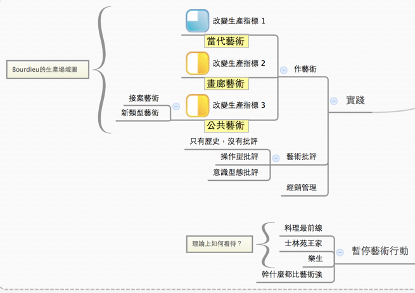

> 此文原为2013年二月五日，受陈界仁与立方空间之邀于树林幸福大厦「拆除前夕论坛」之演讲，原题为〈历史即「诊断」〉。感谢在场朋友陈界仁，王墨林、徐文瑞、侯淑姿、谢英俊、王家浩等于演讲讨论时之宝贵意见。本文经作者增删校订成论文格式。

艺术评论家约翰伯格（John Berger）即便隐居阿尔卑斯山脉下的农村，快乐地骑著重型摩托车，仍振笔著书的唯一原因，是他仍对视界（艺术）批评世界仍抱持希望，如他所说：「我会根据一件作品能否在现代世界里帮助人们宣扬其社会权利，来判断其价值。今天，我依然秉持这样的标准。」(约翰·柏格, 2010)。 作为一个评论者，柏格无需解释艺术生产与社会权利的关系，因为艺术评论者对艺术进行外部生产，透过自身观点将作品与社会连结起来。然而他留给我们的问题悬而未决，艺术实践的知识为何？社会权利是什么？谁的社会权利？思考社会权利可作为艺术实践知识的判准嘛？与「文以载道」和政治美学化又有和不同？

约翰伯格又提醒我们不能只动容于美学情感（aesthetic emotion）而避开艺术与自然的关系，以及艺术与世界的关系。艺术并非模仿自然，而是模仿创造，有时它提出一个全然替代的世界，有时则只是去强化和肯定自然带给社会的短暂希望。他以东欧农民几乎每家农户常会悬挂于屋内，都会制作的精致松木作白鸟，对著我们提问：「火炉上的暖空气摇动著白鸟，户外，零下二十五度的真正小鸟正在冻僵。」，似乎指出这就是艺术实践的核心：视界（艺术）之「替代」或「肯定」世界的两种作用。

要回答艺术的这两种作用，及其与社会权利的关系，首先必得回答我们的艺术实践的知识来自何处？如何被建构与传递？当代艺术理论臣服于哲学家巨笔，端借他们的眼睛审美，相比之下，艺术实践的知识似乎只剩技术，那些我们会教导大学生本科专业的技术工具，或者经销管理需知。犹有甚之，艺术或审美理论还不是由于艺术家受到了哲学启发，而是透过策展人中介了各种当代哲学与社会思潮，或著因应全球双年展的「社会倾向」与「标新立异」的需求，而艺术实践的知识则由教师们猜想市场走向和维持学院机制生产而来。艺术理论与艺术实践的知识实涉及了不同的认识论（而非是认识论与方法论的差别），是「什么是艺术？」和「艺术当如何？」的差别。本文透过检视西方艺术主体性生产之历史，然后回顾台湾历史脉络，图绘(mapping)艺术当如何的基础如何由历史社会过程的知识所形构，如此或有机会可以回应艺术可以是什么的问题。

本文企图证明一个有实践意涵的假设：「艺术实践的知识关乎社会政治过程的知识」，提出「社会性艺术」的雏议。自从到艺术学院教书后，我一直思考艺术实践的知识是什么？是造型原理、技法、表现工具？是美学、哲学、文化理论抑或田野工作、社会调查、参与？是文化行动主义？或者其实就是人生际遇？「跨领域」现在火红得很，但「跨领域」艺术实践的知识到底意味著什么却很模糊。无论如何，美学或艺术生产，总是从属于某种认同体制、某种可视性、可能性以及散布与分享的机会。在台湾，一流学院优秀的学生能够接触更多另类的、左派的艺术理论，也一直培育出画廊与展览大赏的常胜军，那么政治上的基进与美学市场的成功意味著什么？我们要理解这意涵，势必要对艺术实践之论述进行两项工作，一是再历史化，另一将其空间化。历史化和空间化艺术生产为的是要指出**，**无论我们如何不情愿，作为有特殊形式之内容的艺术，总是比我们自己想像的还要接近那些我们不屑的对象。在台湾，艺术理论鲜少面对艺术存在的时空（spatio-temporal）变化尤剧的条件。

# 1 艺术与社会：西方现代艺术主体性之建构

布尔迪厄（Bourdieu）在《艺术的法则》（The rules of Art）书中引用了法国有名的小说家达妮尔．萨勒娜弗（Daniele Sallenave）在1991年写的《死者的遗产》（Le Don des Morts）：

「我们难道听任社会科学将文学、人们与爱情一起造就的最高经验，简化为我们对娱乐的探索，而无视我们的生活意义？」（Paris Galimard, 1991）(Bourdieu, 1996, p. XV)

社会科学家似乎是谋杀美学感动的杀手，这也是艺术圈总排斥社会科学家对他们作分析，觉得这样一来就丧失了美学感动和创作的能力，作品与感动被「解释掉了」，创作意图必须要与社会脉络关连使他们失去自主性。重要的左翼艺术社会学家阿诺德．豪瑟（Arnold Hauser），他在1974年出版了德文版的《艺术社会学》，1982年翻译成英文版，曾写过一句话：「**我们可以想样一个没有艺术的社会，但无法想像一个没有社会的艺术。**」(Hauser, 1982, p. 92)。对他来说，艺术要放在社会结构和历史里头看，艺术固然是社会的产物，艺术创作服膺于既定、统治者的阶级意识形态，然艺术也有可能回应、批评并且挑战既有社会体制的实践。艺术作品是一种辩证的结构，不只是有形式的内容，不只是有一个接受的「你」跟一个说话者的「我」两者，而是作者跟观众之间连续的互动所发展的对话，一个互惠参照的关系系统。于是，社会也有可能是艺术的产物（society as a product of art）。我想从这两个不同的看法开始讨论。

## 1.1 艺术主体性

这张麻荖图，是布尔迪厄在分析艺术场域的状况时所描绘的。我将原本的中心形状的区块由台湾传统食物麻荖替代，这是艺术代在历史中存在的方式。过去到未来的时间轴里头，先锋派永远是在最上面的那条线，就是A到A2，主流艺术是A-1到A1，「后卫部队」就是A-2到A，这三条线也可更简单阅读，当一个艺术家如A，在过去是属于先锋部队，当顺著时间轴走到中心时，就成为主流的中坚份子，若无改变而往未来去，就是落在后卫部队的队伍中。真正被权力与体制承认的艺术生产场是在麻荖内部，也就是艺术场，而「艺术代」指得是麻荖的右半部，从现在到未来的那个区块。

在有著时间性的社会场域里头，没有固著的艺术世代。任何一个前锋艺术，都有机会成为主流艺术，但如果太前卫了，则会出了艺术场认可的范围。透过这个图示方可理解我们谈论的艺术主体性如何在社会结构里被创造，而拥有一套相应的实践知识。过去的先锋派可能是边缘的、进步的，如能活存下来，则在当代占据了艺术生产的领导位置；若无自我更新生产，就走出了艺术场域，太激进或太保守的其实都会在艺术场域里头被排除掉，中间的艺术场是艺术生产的结果，这是艺术场域的动态过程。

社会场域生产也需要历史化的看待。塔夫立（Manfredo *Tafuri,*1935-1994）是义大利威尼斯学派非常重要的建筑史学家，他曾经在一篇简短访问〈**没有批评，只有历史〉**（*There is no criticism, only history*）(Tafuri, 1986)中谈过，所有的建筑批评（包含艺术批评）都有一个主要问题：批评者都在做意识形态再生产的工作。如果把艺术批评分成几种类型，第一种类型称之为操作型批评，比如看到一个作品，我们会说这个作品如果怎样改会比较好，或是如何布置空间感会比较好，好像是在帮艺术家决定他如何可以更好的可能，是一种工具主义或修补式的操作；第二种批评称作意识形态再生产，只是顺从艺术家的作品和理念来谈，比如陈界仁的〈幸福大厦 I〉作品，他如何可能是一个微型感知与临时社群，论者其实只是复制了艺术家的意识形态，然后重新帮他生产一次。对塔夫立来说这些不是批评，对他来说只有对意识形态的批评才是批评。批评是一种解密工作，真正的批评功能唯有历史才能达致，历史学家必须创造一种人工距离（artificial distance）来进行批评，要对时代的差异与时代精神（mentality）有所洞视，对艺术家生平与作品系列有连续思考，要有历史反复之思，才不会让批评沦为意识形态再生产的危险。既要对艺术生产的场域有所体会，也需要历史地看待场域变化的逻辑，进行批评之解密工作，我们可以先从西方现代艺术主体性浮现之历史开始。

## 1.2 欧洲：双重拒斥结构

波特莱尔和福楼拜都是活跃于1840年代左右，那时候是广泛艺文现代主义的诞生，波特莱尔曾说：

> 「指出我们在资产阶级和社会主义这两个相反的派别中看到相似的错误，真令人难过。说教吧！说教吧！这两派都以一种传教式的狂热叫喊著。」(Bourdieu, 1996, p. 47)

法国有几次重要的革命，1789至1791年路易十六与玛丽皇后上了断头台，影响了整个欧洲；1830年七月革命波旁王朝覆灭，1842年第一次由中产阶级与工人阶级携手建立了共和体制，拿破仑的侄子路易．拿破仑．波拿巴上台，一开始他是个共和主义者，他的登位是无产阶级跟资产阶级联合携手所成就的，但他后来在1848自立为帝，将法兰西由第二共和领向第二帝国（1852-1870），这场革命对马克思而言是失败的，也让马克思重新思考历史反复性与资产阶级革命之限制，思考就在他写的〈路易．波拿巴的雾月十八日〉（1852年）一文中。从1842年至1871年三月巴黎公社成立（推翻了路易拿破仑）这中间，正好是现代艺术主体性浮现的语境，就是我们现在谈论现代主义萌生的时间点。波特莱尔（1821-1867）、福楼拜（1821-1880）、巴尔札克，稍晚的马奈（1832-1883） 、莫内（1840-1926） 、塞尚（1839-1906）等所谓（后）印象派，都在那个年代慢慢成名并影响后世。

当时的艺术家遇到一个非常根本的问题：如果他们（资产阶级艺术家）不要再跟皇室维持依赖关系，他们可以怎么办？那时候的法国皇室定期举办沙龙，艺术家参加沙龙如果得到法国皇室的奖赏，就可以得到年金。新一代艺术家常不屑这种为奴的比赛，比如BBC资深艺术记者威尔．冈波茨（Will Gompertz）的书*What Are You Looking At？150 Years of Modern Art*，描写了印象派与古典主义（皇室派）间饶富趣味的斗争。书中有一段描写莫内、马奈等艺术家一起坐在咖啡店里商讨要办展览，席间竭尽可能的嘲笑皇室沙龙展，他们要的是办一个自己的「真正」艺术展(Gompertz, 2012)。然而，他们也不喜欢当时住在巴黎河左岸那些拉丁区穷艺术家与穷艺术学生们（这跟当时巴黎新增加了许多艺术大学有关），如普鲁东（Pierre-Joseph Proudhon 1809-1865）这些无政府主义者。他们认为艺术不应该为皇室阶级服务，可是也不应该为人民服务、为社会服务。波特莱尔、福楼拜（别忘了，他们都是家道中落的资产阶级）等艺术家在当时亟欲解决的困境。

从整个欧洲文艺复兴以降的艺术发展来看：资产阶级的需要生产了艺术市场，而后才有艺术家的需求，艺术家从早期的皇室委托人（工匠）一直到画廊的出现（艺术家职业），大概从文艺复兴16世纪到1840年代左右才渐渐完成，自由市场中的艺术家于焉出现，艺术家主体性的论述于焉出现 。

欧洲**现代艺术的主体性是透过双重拒斥完成，抗拒社会艺术（social art），**艺术不应该为人民服务，也抗拒为皇室服务的艺术，艺术应该也只能「为艺术而艺术」，这是在法国两次人民革命期间慢慢建立起来的现代艺术的自主性。艺术家透过拒斥双重结构以建构资产阶级本身的艺术自主性场域。同时，此种特定阶级的社会认同与美学观点是一起打造的，这样才可以理解法国印象派和后印象派在1870到1910年代期间，绘画的主题总是跟阶级斗争中的「休闲」意涵有关，这是著名英国艺术史与艺术评论家T.J.克拉克（T.J. Clark）的观点(Clark, 1986, p. 204)。这段时间内，印象派或后印象派有非常多绘画主题都在描写中产阶级的城市地景与休闲生活，这是以前皇室画家不敢想像的。以往不曾出现的都市中产阶级生活、街道景色、草地上的野餐、咖啡馆、小酒馆、吧台女或仕女服饰成为绘画主题。显然的，现代都市生活对艺术家来说是崭新的经验，时空结构建筑了阶级意识与阶级美学，类似的主题画作是此阶级对于新浮现之都市生活的「享用」与认同。别忘了，这时的巴黎乃是**豪斯曼（Georges-Eugène Haussmann,1809-1891）**改造过的巴黎，是拆毁巴黎旧城与旧生活的现代都市规划区域的开端，以宽敞大道取代旧市区的巷弄，避免街垒战的再度发生，也方便政权更容易以大军镇压人民的革命行动。另一方面，塞纳河上的西堤岛上贵族们还有蒙马特区的上流社会将塞纳河左岸的波西米亚年轻人、穷困潦倒的艺术大学生、无政府主义者永远隔绝了，这正是资产阶级透过都市计划划分空间阶级的开始(Harvey, 2003)。对塞尚、马奈而言的美妙都市休闲生活，乃是建立在区隔贫富，防止革命发生的空间计划之上。艺术不仅仅是个人意识形态的反应，艺术创作过程包含特定情境下的艺术家如何再现世界与自己的关系，在特定的空间（法国印象派都市生活与豪斯曼进行的大巴黎改造计划）与历史条件（法国1848-1871年之间）下，布尔乔亚阶级与小布尔乔亚阶级（petit-bourgeois）为了区分不同阶层，有意识地（虽然部分是反应了自身阶级的条件，但非必然）打造了自为阶级（class for themselves）。如此才能解释艺术家有意识的美学创造与社会实践的关系。

## 1.3 美国：冷战文化下的艺术主体性

西方的现代艺术主体性，直到1940-60年代，才由葛林伯格（Clement Greenberg）完成最后一曲，建立了「防卫性的主体」。格兰凯斯特（Grant *Kester）* 在《对话性创作》延续了布尔迪厄的观点：「**艺术家对社会主义不再迷恋，又讨厌资本主义，他唯一的避难所就是躲在具防卫性的主体里，并且完全拒绝『可能理解性』」**。(Kester, 2006, p. 66)凯斯特的批判有其社会历史条件，其透过拒斥欧洲的现代艺术主体，从而建立一套反（欧洲）菁英论的艺术生产方式，他说：

> 「在葛林伯格对于媚俗的刻板模式上，以及福莱德对于剧场化的批判里，都假设这种开放性只有以漠视（或侮辱）观者及其联想和之前的经验时，才能得到。一旦作品透过共同的语言、熟悉的视觉惯性与观者互动，或隐含认知到观者处于同个空间中，它就等于是遭到天谴和否定。」(Kester, 2006, p. 80)

对凯斯特来说，欧洲的艺术自主性排除了对话可能性，任何有意图和功能的、可供理解或诠释的作品都是大众流行之鄙物。然而，他所提出的「对话框架」却让艺术作品免责了，让艺术家从美学形式与伦理要务中解放出来，为人民说话转化成让人民说话，却不保证人民说话的有效性，以及让「什么样」的人民说话的政治判断，艺术家也无须为自己的作品形式负责，因为这是人民参与或是持续对话的结果，这样一来，连带著将社会艺术为底层人民（工人、学生、穷苦大众）发声的意涵都一并取消了，人民变成个体的集结而已。

凯斯特的「美学民主化」其来由自，是文化冷战意识型态的延续。美国自二战后透过CIA、洛克斐勒中心向欧洲推销抽象表现艺术，企图将艺术中心从巴黎移至纽约，「文化是冷战的宣传品」，「抽象表现主义是冷战的武器」是许多当代艺术教科书中的开章说法。艺术家如杰克逊波拉克（Jackson Pollock）常被讥为冷战斗士（cold war warrior）， 如路易斯．梅南（Louis Menand） 2005年在纽约客杂志（*The New Yorker*）上写的一篇“ Unpopular Front”文章中提到，冷战时期的文化斗争早已不是秘密，甚至连1946年成立的傅布莱尔奖学金（Fullbright Program）也扮演如同CIA的角色，也是冷战思维下的产物。依娃卡．克洛夫特（Eva Cockcroft）的文章就写得更清楚了(Cockcroft, 1985)。美国文化宣传的对象是国外的菁英，左翼或有左翼连结的，或者同情苏维埃或毛主义的，使他们仍然维持前卫的左翼思想，但只要反共产党就好，这是美国在战后的全球布局。

觉得艺术和CIA、洛克斐勒中心没有关系，这恰好是艺术维持中立保持干净的幻象。为了积极与欧洲、中国左翼分庭抗礼，有自己的文艺地位，基金会、大学、文化中心都是重要工具。除了主动推销自己的政治美学外，另一方面则透过半殖民地的「使馆艺术」来作为冷战的文化武器。

台湾的素人画家洪通就是最好的例子，洪通第一次个展是在台北美国新闻处林肯中心（1976年），1987年美国文化中心艺术家杂志社在他死后举办了回顾展，回顾展结束后，台南县立文化中心才收藏了三幅。洪通这辈子总共画了三百多幅，最后穷困潦倒地死掉了。他的第一次个展是美国文化中心办的，死掉以后也是美国文化中心办的回顾展，在美国强力的促销下，台湾似乎才惊觉到有这号人物，随后台南县立文化心才收藏，没有什么比台湾的本土是美国「发明」的来得更讽刺了。另一例子是爱荷华国际写作班，台湾早期有许多的文学家和艺术家去参加过，像陈映真、林怀民、蒋勋、高信疆、痖弦、台静农、向阳、商禽、蔚天聪、管管、姚一苇、殷允芃、季季、楚戈等等。这形塑了早期台湾文艺的意识形态，将美国提倡的意识形态带回台湾，是台湾现代主义的文学传统如此地与美国价值亲近的原因，现代舞蹈上林怀民则是最好的例子。中国也是一样，中国八零年代左右的北京使馆艺术区，像艾未未的《黑皮书》与后来的八五现代美展，就是使馆区里开始的，台湾和中国的艺术历史，都受到美国的冷战思维下推展的经济文化布局所影响。

如果说欧洲历史前卫主义关切的是菁英艺术与日常生活的界线如何缝合，高低艺术界线如何突破，积极挑战艺术机构所垄断的艺术生产方式，达达、超现实一直到七零年代的Fluxus都有这种特性，其展现了对现代艺术逐渐专业化与体制化的反思与抵抗。美国在战后需要的不是挑战菁英艺术与艺术机构，他们都还没有呢，这才能解释为何抽象表现主义与普普艺术看起来泾渭分明，道不合谋的两股艺术风潮没有冲突地为美式政治美学形式开疆辟土，美国也同时持续建立大型的美术馆与艺术机构，例如MOMA来增加自己在文化艺术上的影响。我们或可说，美国终结而非继承了欧洲的历史前卫主义，美国将欧洲历史前卫主义与知识分子对于体制批判，以后现代式的、普普艺术口吻的、巨型艺术机构、商业画廊的商业机制取代(Huyssen, 2011)。

美国的现代艺术主体性还有一些更复杂值得深究的过程。在六、七零年代从后葛林伯格艺术实践上逃脱的人，他们把英国原有的社群艺术（community art）传统，与美国的新类型公共艺术（new genre of public art）结合在一起，**透过作品、策展和论述**，与美国逐渐在全球取得主宰性地位后向外传播。八零年代之后，在冷战文化武器逐渐失去效益后，以英美为主的艺术家与策展人找寻可以替代欧洲中心主义的艺术理论的实践，来接续六零年代美式普普艺术后期无力和快速商业化的困境，以民主、对话、参与形成艺术实践知识的主轴，替换了欧洲历史前卫主义的未成使命。比如说之前所提的凯斯特的《对话型创作》，他强调连结性的知识、对话性的框架、强调实践式的艺术操作(Kester, 2006)，蕾西的新类型公共艺术(Lacy, 2004)，伊恩．杭特（Ina Hunter）及西莉．亚伦娜（Celia Larner）的「潮间带艺术（littoral art）」，或是比夏的参与艺术(Bishop, 2006, 2012)、法国艺评家尼可拉斯．布里欧（Nicolas Bourriaud）谈的关系美学(Bourriaud, 2002)等等。我们可以如此重读凯斯特的话：「穿过（欧洲）画廊的墙壁，直接面向（美国的）世界，把主体间互动的新形式（媒体）和（美式民主的）社会运动结合。」(Kester, 2006, p. 23)。（括号内为作者所加）

简言之，二零年代达达主义、义大利未来派、六零年代超现实主义与国际情境主义者，他们努力将艺术推到社会脉络与政治框架里。六零年代后，苏联式的英雄写实主义退流行，毛泽东还在忙文化大革命，欧洲战后元气大伤，这个意识形态空档由美国填补，到了八零年代像丹托(Danto, 1997)之流把艺术推到历史终结之后，肯定了后现代及其政治美学，弃置了现代性未完成的计划（哈伯玛斯所关切的）之一切努力(Habermas, 1997)。丹托说的「事事都是艺术品」，或是波伊斯说的「人人都是艺术家」，其实没有改变艺术生产的方式，只改变了艺术被认知的方式。素人画家极速消失，他们也永远不会变成学院里的艺术教授。如丹托自己承认的：「只是艺术家各吹各的号，各自行事。」这些说法基本上都是由市场认证、学术部署、美学风格的生产，增厚了美学价值的目录而已。晚期英美发展对抗欧洲中心的模式，是从政治斗争（冷战结构）到美学的「民主论述」（文化冷战）的空间争夺的历史，欧洲一开始筑起围墙（艺术主体），然后努力要打破（菁英与民众）围墙，而美国自始至终都是要想尽办法卖到围墙之外。

民主美学的全球化，与美式民主在全球推销是有亲近性的。美式民主美学化最具代表性的是安迪沃荷（Andy Warhol），他曾说麦当劳是全世界最民主的地方，不管是总统去买一份麦克鸡块，还是一般人去买一份，内容物是一样的，不会因为你是总统就多给你一点。然而他没说的是，世界人民因为麦当劳的兴起而变得更为肥胖、不营养，丢掉了传统食物和与之关连的文化，速食不是消除阶级而是消除国界，对资本家来说，最美妙的事情莫过于无论总统还是平民，中国还是非洲都非得买单。美国现代艺术主体性是跟美国在冷战结构后取得全球世界史之有意义的角色（黑格尔观点）有关系，吾人才能理解为什么创作性对话艺术、新类型公共艺术等等参与艺术的观点，能够那么快变成另一种实践典范的原因。

# 2 台湾：新国族与新自由主义下的艺术主体性

台湾历经日本殖民的现代性，乡土美术等运动，海归派引入的现代艺术思潮等有许多专论，于此不再多述。我将专注处理九零年代，一方面，这是有政治历史意义的时刻，一方面也是台湾在经济达高峰时新自由主义开始浮现的历史阶段。

九零年代，政治上的「台湾主体性」浮现了，「国族国家」（nation-state）作为民主选举斗争的意义首次明确。李登辉在1991年结束了动员戡乱时期，尔后三、四年是台湾本土论述建构很快的一段时间，新国族需要新的文化主体性，需要服务于政治主体的艺术，服务于新台湾的美学形式。艺术界大步跨入「后殖民」与「本土性」的争辩。1996年台北双年展的前身「台北现代美术双年展」即以「台湾主体性」为主题（陈水扁时任台北市长），同年也是台湾总统直选。这几年间公立美术馆推出三挡重要横跨五十年、一百年的台湾艺术史的展览。艺术因为政治跟社会确保了特定的美学说法之正当性才可以形成，艺术从来不是先于政治或社会的。

台湾的经济于1990年达到高峰，1989下半年成立的画廊数量远远超过过去三十年的总和，台湾第一场都市社会运动无壳蜗牛运动也是在1989年。之后开始下滑（文化大学的小草学院抗争绽放于1990─1991年），随著经济规模扩大， 出现了非常多替代空间，比如1988年的伊通公园，1989年二号公寓成立（1994年结束）都是发生于这个时间点。另类空间或替代空间其实是经济繁荣的另外一面。人们通常都会很容易觉得替代空间是在抵抗资本主义、比较进步，但如果不是资本主义的高峰，替代空间要替代什么？反对什么？从历史上看，任何的另类，都是在资本主义高峰的时候产生的。另类是一种余裕的文化。

当时有两个非常重要但常被轻乎的辩论，一个是倪再沁的〈西方美术台湾制造〉(倪再沁, 1991, 1992)，对他而言，台湾是西方形式的殖民地，我们从西方学习回来的「形式」应该要经过感受地方资料来重新填装内容，这才能建构台湾自己的艺术主体性，开展新的论述方式（这多像建筑界弗兰普顿（Kenneth Frampton）谈的批判的地域主义啊）。另一个是陈传兴，他认为台湾根本没有现代性，现代性是匮乏的，只有现代风格的概念(陈传兴, 1992)，陈传兴认为我们忽略/跳越冷战时期的世界结构，把现代性变成一种美学形式而已，我们对于民主政治的要求，对于社会改变的渴望，然仅将现代性作为仅仅是美学风格来反应对社会的不满与突破。倪将西方现代艺术视为可资利用的形式库，而陈则认为形式库的看法恰恰好正是西方现代性一开始要革命的对象。

然而，艺术主体性的构造不仅只是思想或是政治偏好。台湾第一届的画廊博览会在1992年开始，1992年到2000年左右，第一届画廊博览会的交易金额是5亿台币，达顶峰，2000年下滑到7000万台币。两家国际拍卖公司苏富比和佳士得分别在1989年和1990年成立，1992、1993年首拍，到了2001、2002年就结束转移到香港，这些都发生在台湾最风光的年代。2000年之后，台湾的艺术市场一直往下掉，之后是顺著中国艺术热潮流在卖。艺术主体也需要制度上的支持，1983年北美馆成立、1988年国美馆成立、1994年高美馆成立，参加威尼斯双年展是从1995年开始，1996年是威尼斯建筑双年展，1996年国艺会成立，1998年第一次台北双年展，2000年「公共艺术设置条例」和「都市闲置空间再利用条例」出炉，这两个条例都让很多艺术家变成接案者，从事许多大型公共艺术的生产。「闲置空间再利用」政策的缘由要溯及1997 年台湾省政府时期的文化处所委托研究案，当时研究后即刻进行建构工作，至2000 年总统大选政党轮替，民进党政府文建会将「闲置空间再利用」作为文化施政重点，于是大量公家闲置空间释出，改造成为艺文空间。在制度化与参与国际展览的高峰期间，2001年北艺大、台艺大同时改制成大学，南艺大也在2004年改制成大学。当我们的学术结构要应付艺术高峰的生产期的时候，艺术市场已经往下掉了。学术机构为了产业的变化而增加，却永远慢于产业的变化，原本因应产业高峰的人才需求增设的系所与升级大学，万没有料想经济快速地往下掉，空出来的「空间」与专业人才必须透过制度化的补贴经营。于是，台湾的艺术生产在2000年后成为内需的、补助的市场，恶性循环地加剧了艺术学院化的脚步。同一时期，画廊的数目则锐减，从1990年开始逐渐兴起的画廊如高雄阿普、时代画廊、当代艺术、台湾画廊、台北阿普、二号公寓、雄狮画廊、新生态、杜象、串门等等，台湾画廊从鼎盛时期的200余家，到了2000 年，据文建会的文化统计资料显示只剩121 家。

除了艺术经济与学院状况外，九零年代还有一些内嵌的历史性条件。包括了殖民/后殖民导致的没有主体的现代性，分裂国族认同的复杂性，新自由主义的矛盾主轴、以及多元文化与都市社会意义再结构等等。

## 2.1 没有主体的现代性

台湾第一任总督府民政官鹤见祐辅，官位如同今日的内政部长，台湾总督府就是他开始兴建的，他曾说：

> 「台湾人是属于物质的人种，黄金与礼仪、华厦与宏园是他们所尊崇      的对象。唐代（疑为汉代）的诗歌亦云：『不睹皇居壮，安知天子尊』。       要统治此类人种，宏伟的官衙亦有收服民心之便。」 。

缺乏主体性，或说缺乏反身性的主体性，使得台湾的殖民情境一直未曾远离，就是法农所谓的集体精神官能症(Fanon, 1967)。我们一直觉得很饥饿，所以孩子们要到美国、欧洲去念书，我们在文化上也很饥饿，所以要从日本、西洋拿流行文化来。我们一直有这种饥饿感，即使我们的文化与民主已相对成熟，台湾国族主体性在2000年前后也开始打造，但我们仍然觉得饥饿，如同精神官能症的病患一样。别人告诉你不饿了，却一直感觉饥渴，一定要从外面拿东西，所以台湾一直都有亲美的学术和亲日的文化，这是历史性的阻碍之一。也因为这样，后殖民与现代性的关系错综复杂，也使得其利用充满了各种机会主义。

机会主义者常常爬上国族主义的床。1995闰八月事件的危机成为李登辉打造新台湾的机会，1995到2000年他任国民党主席，是台湾国族打造的重要时间点。他塑造了新台湾人的论述，论述建立跟中共的飞弹对准台湾是一起产生的，透过外敌建立新的国族国家想像。加上冷战结构的影响，1989年苏联虽然瓦解，但台湾似乎仍未苏醒，仍在美国/中国，蓝/绿的政治框架中想像自身的位置，经济实践跟从政治决定，从许信良的西进政策被迫转向李登辉南进政策，在2000年后势不可违才大幅转向中国。分裂的国族认同（fragmental nationality）在九零年代以后变得越来越严重，所有的公共论述，到了国族认同的门口就会停住，无论基进的或公共的，最后都会变成蓝的或绿的，或统或独的，九零年代以后难以产生像八零年代影响甚钜的公共型知识份子。国家机器也清楚知道，权力只需将公共知识分子归类就不具杀伤力。于是，攸关公众的政治批评常简化成政党认同的选择，公营事业被简化成国民党事业，公家被简化成国民党优惠党员与官员的慰劳所，「公」的瓦解正好为新自由主义铺好了路。

## 2.2 解除管制与重新分配

城市既是新自由主义的统治与产业实践得以发生的空间，也是这些实践借以运作的空间。新自由主义在九零年代的台湾主要有两个特征：另类／反抗文化的制度化，以及都市意义的再结构。

九零年代跟新自由主义同时进行的正是繁花盛开的另类/地下文化。新自由主义强调的个人自由与个人文化投资恰好是另类文化需要的意识型态。1988年田启元成立「临界点剧团」，1993年台大旁的甜蜜蜜咖啡馆开张，1993年陈其南开始提倡社区总体营造计划，同年台北县在三重河堤案一群地下文化青年搞起了「破烂生活节」，1994年《破周报》创刊，春天呐喊音乐祭、野台开唱、女性艺术节首次举办，1995年国际后工业艺术祭、台湾第一次的锐舞派对（Rave Party）出现。接著，1996年陈水扁当选台北市长，开始有很多公办舞会，新生南路的飙舞，同一年也进行宵禁。未满18岁的人午夜12点以后不能去KTV或夜店，1997年废娼，还有14、15号公园运动，也就是陈界仁《性福大厦I》里搬迁行动与行李箱所隐喻的事件。1996到2000年，每年都有公办舞会。1993年，立法委员想把华山酒厂改成新的办公大楼，引发艺术家不满抗争，艺术团体努力争取的华山作为艺术家园地的结果，是2007年台湾文创公司进驻管理，华山于是变成我们今天看到的样子，由社会抗争所争取保留与艺术家自主组织每年超过三千场的地下表演与展览，最终沦为委托经营的商业文化园区，当初的艺术家连一个仓库都租不起做展览。不稳定的，具有抗争性或具有破坏性的文化行动，后来都变成文化创意产业了，但历史作用者并非享其利益者。

1995年WTO成立，此架构要取代世界货币中心（World Bank）成为国际组织。为了成为WTO会员，李登辉在1996年喊出了亚太营运中心。更早之前，行政院在1989年成立了「公营事业民营化推动小组」，1991立法院通过「公营事业转移民营条例」，直到2002年，台湾才正式加入WTO。2000年之前台湾努力推行国营事业私有化（1998年初为止，台湾已有七家国营事业、五家省属行库和单一事业（台湾机械公司）的三个工厂完成所有权移转(张晋芬, 1997)。其中最引入注目，并且被国外许多研究全球化与新自由主义的文章所分析的例子，就是中华电信工会2000年左右的抗争事件。中华电信是第一家采取私有化的国营企业，当时是台湾最大的电信公司，亚洲第五大，世界排行第十五。自从中华电信之后，国营企业私有化就几乎没有遭遇任何阻碍了，甚至人民也乐见其成。接著电影开放，好莱坞配额的解禁，同年解除报禁、电视媒体，开始有第四台。选择众多正是新自由主义的特性之一。

之后的故事非常熟习了，乐生青年、宝藏岩、剥皮寮、都市更新、国光石化、无数科学园区、东海岸BOT等等一波波贱卖国土与炒作土地的政策。这就是我称作「都市意义的再结构」，也就是说，所有的非正式的地景（informal landscape）全部都变成制度性的地景（institutionalized landscape）。九零年代都市地景与都市意义的再结构在各方面显现，从非正式的节庆也好、锐舞派对也好，摇滚乐也好，2000年后全部走向制度化。文化事业主要靠「公共投资」，所有人都开始拿补助。以前年轻人自己办派对搞事件，现在都被公办的跨年晚会所取代，政府把台北市新生南路整条围起来帮年轻人办一个马路派对，年轻人还能更享受道路使用的权力嘛？非正式的文化活动和违建地景全部都变成制度化地景，自主摇滚嘉年华卖起昂贵门票，将一支支手环套在高喊自由摇滚万岁的孩子身上，户外的电音派对走进夜店消费，这就是九零年代的开章故事。

艺术总是表达了与社会谋合或批判的观点。在前述的政治与经济转变的结构中，1980年代西方艺术思潮大规模登陆，解严1987年前后自由解放的风气，因而80年代也是台湾画会兴盛之时，与彰显现代绘画运动的「五月」与「东方」画派不同，这时艺术家常以前卫姿态，对所在社会与艺术环境，提出自主性的表达，在创造自主性语言时多半强调文化脉络的差异(王文英, 2008)，寻求本土艺术风格成为艺术趋势，如南台湾新风格画会。1986 年12月陈界仁、高重黎、林巨、王俊杰成立的「息壤」，以激进态度选择空公寓、摄影棚等展出空间，揭橥反美术馆主流文化空间、反画廊、反媒体、反主流媒体杂志的操纵运动，开启了台湾替代空间（alternative Space）的发端，是为后来伊通公园（1988-, 台北）、2 号公寓（1989-1994, 台北）、新乐园84（1995-, 台北）等替代空间对主流空间批判之滥觞，这正是前文所提台湾的经济繁荣高峰期。相应于解严前后创造自主性与本土性的语言的需要，替代空间争取的乃是对日益巨大美术机制的反抗，犹似欧洲的达达主义精神，但在与中国抗衡的台湾主体性建立的急迫性下，国家体制透过积极补助展览打造本土与台湾意识，越是这样，推翻推翻体制（本土正当性）就越不可能。虽然画会与自主的艺术团体在很多时候有所交叠，艺术自主与台湾自主有著表现性的相像性，尽管他们的目标不同。

八零年代各种抵抗文化，经过学运这代把它搞得更地下更肮脏，或更政党政治了，无论何种，都在2000年左右全部收归国有。收归国有的意思就是收归制度所有，收归制度所有的意思就是收归私有，资本所有，亦即为新自由主义铺好了制度之路。谈论新自由主义的第一个核心特质是「解除管制」（deregulation），解除管制表面意味免除私人资本并吞垄断的种种限制，在台湾，就是解除公共财（commons），取消公善（common good）及其包含应有的公共服务与公共事业容许债务等等，从另一方面看来，就是透过制度吞噬所有外于市场交易运作（国营企业、大学、地下文化）的东西。新自由主义第二特征则为「不是增加生产而是重新分配所得」，张晋芬的研究清楚地指出几个重要数据。虽然台湾的贫富差距就基尼系数看来，一直低于0.4，在合理范围之内，但若依据财政部税收的估计，将台湾的「每户可支配所得」分成五组，最高一组除以最低一组，那1990年是5.31倍，2001年约6.39倍，2009年则是8.22倍（不计算政府社会补助）。若是分成二十等分计算，则非常惊人，2011年的贫富差距（前百分之五与后百分之五）则高达96倍，这正是大卫哈维指出的「阶级复辟」之意，新自由主义的发展让资产阶级恢复财富，回到二战前的贫富差距状况(Harvey, 2008)。

# 3 历史即「诊断」

八零年代艺术和社会的关系比较密切，迈入九零年代后，艺术实践被制度化了，向双年展与奖项靠拢，新人则在大学时期就急著与画廊签约。艺术批评则失去对未来历史的期望，没有目的的批评成为作品符号分析的呓语。社会学、文化研究、精神分析、批判理论成为包装作品的文字背景，艺术生产里少了社会学跟历史学的训练，缺乏在地脉络，以致于被拔了牙的基进理论旅行到宝岛后，只剩下文气很强的抽象论述，在多数年轻艺术家的策展论述中都可以读到。



在实践上，如用「作艺术」的图表来描绘台湾当代艺术生产状况，让我们思考一下布尔迪厄的艺术场域图，画廊艺术占据了主流到保守的位置，让年轻孩子有曝光机会，进入市场竞争；当代艺术则靠各式大型展览占据了先锋到主流的位置；公共艺术又分为两种，接案型艺术，艺术家与策展公司接各式公共艺术的案子，跟工程一样做完就结案，艺术就像任何一个有时效的计划一样，程序要求的民众参与也仅聊备一格，影响力与经济牟利差距很大，处在主流到保守的位置。另一种是新类型公共艺术，艺术进入社区，艺术进入空间等等，到目前为止改变生产指标很弱，正从先锋往主流迈进，此类工作很容易在论述上被谈论，被媒体化与大赏化，可是对主流艺术市场来说不太有影响力。

另一种，我称之为「暂停艺术行动」。有些行动与作品充满了跨界与不稳定性，例如发生在士林王家的「料理最前线」团队，他们自己筑起炉子烤面包，透过煮食与分享重建社交网络，组成份子大部分是艺术大学的研究生，这算是艺术生产吗？士林王家的抗争、都更受害者联盟也是一样，许多艺术学院的学生参与其中，在八一九事件中包围内政部的运动中在内政部广场地上涂鸦作画。乐生青年们做了一个无敌铁金刚的巨大人偶，在文化部开会的时候举了大布条抗议，这些行为到底算什么？艺术学院学生完全不考虑艺术？还是厌倦了艺术总是帮著建商/政府进行增殖工具？他们放下「艺术」，觉得干什么都比艺术强，起码比艺术还具生产性。

回到本文核心假设，如果艺术实践有套知识的基础，那这知识系统一定关乎「社会政治过程的知识」，一旦实践的知识背向社会政治过程，艺术理论的「什么是艺术」就会不断地从现象学、美学、哲学来谈论作品本身，最终导致艺术实践的知识是最差的那种形式主义，沦为工具与操作技术。当代艺术面临的是日益专业分殊及新的日常生活与政治的要求，以及在地政治与社会框架出来的条件，艺术家再也难以技法去提问或者回应当代变动。若艺术实践是要介入视觉与感知分配的生产关系中，包含了生产工具与再生产关系，如无理解社会政治过程的知识，就无法知道如何掌握当下的生产工具，以及艺术在再生产关系中的作用是什么。从台湾九零年代的历史看来，建立一套有关艺术实践的知识与我们如何面对新自由主义空间化的问题是密切相关的。

新自由主义与自由主义最大的差别是，其并不保证有一个框架或平等机制让每个人可以实现自由，你的成败就在你个人身上，你的身体就是你的投资，是你的全部努力决定了你生命的奖赏成就，一个人如果失败了是个人的问题，和社会结构没有关系。为了阻止社会键结（social-bound）毁灭后的混乱，新自由主义的孪生就是新保守主义。当我们鼓励每一个人竞争，每一个人的自由与成就都是靠自己实践的能力所获得的时候，就需要一个保守价值来框住这些混乱，补偿在竞争过程产生的不满与失败，比如家庭价值、宗教价值、异性恋价值。新保守主义的道德跟新自由主义经济福音是对孪生儿，经济上、政治上让每一个人负全责，在道德上用新保守主义来黏合混乱个体，在他们生命中找到依循的价值。新自由主义带来经济的竞争以挫败，使得个体更需要保守价值的庇护，需要看起来已经过时的信仰慰藉，这正是各式各样基本教义（不只宗教上的，包含爱情、家庭、幸福感与光头党）再度兴起的原因。

我曾以「品牌地景（brandscape）」的观念(Huang & Annie, 2006; 黄孙权, 2010)来描述台湾城市地景的历史过程。城市地景意义之形构可以分三个阶段，第一阶段是发现了一个历史之地，像宝藏岩、康乐里或剥皮寮，它们因经济发展要被拆除，运动者出面争取保存，跟政府抗争协商，它们或有机会被保存下来。第二阶段是空间专业者开始进场，他们把运动者所支持、极力争取保护的地方重新修复，比如说剥皮寮，建筑师在剥皮寮修了十年，把真的老招牌拆掉做个假的老招牌，把所有的东西都粉刷，粉刷得像以前一样，电影《艋舺》里面假的街道与假的黑帮其实就是建筑修复的真实指涉。最后一阶段，就是艺术家进驻，作为地方升值的最后一哩。剥皮寮首次开幕艺术展简直吃尽了剥皮寮运动与历史的豆腐。社会运动先介入、建筑师接手，最后，艺术家作为品牌地景的化妆师或进驻者，这正是台湾品牌地景的一般过程。这不仅是迪斯奈化历史地点，而是历史保存运动被吸纳入新自由主义的过程。

艺术家是外于此生产体系的，总是在历史决定后才进去作为艺术家，才进入艺术村，才去表演。艺术家可以不只如此，可是艺术家常常安于如此，他不需要参加真正的历史斗争的过程，只要享受最后历史给予的成果就好。

宝藏岩艺术村是个好例子，1997年十四、十五号公园的「反对市府推土机」运动挑动争议后(黄孙权, 2013)，市政府开始较细心处理违建拆迁，暂缓以推土机直接拆房，使得宝藏岩成为市政府与进步运动组织的「停战区」。宝藏岩是山坡边缘上长出的龉陋却参差有序的自建房舍，老兵、外配、原住民混居的社区，邻近人文荟萃的台大公馆区域。我与一群同志在1998宝藏岩举办了第一届「台北市弱势社区博览会」，邀请了当时想要选市长的候选人来签支票保证不拆宝藏岩。龙应台时为台北市文化局局长，觉得宝藏岩既是违建，应该很适合搞「贫穷艺术村」，她想像这个贫穷艺术村有希腊小村的潜能，从对面的福和桥过去看，山丘上的房子如果全部漆成白色，就如同希腊的山丘上一般美丽。2002年后她下台，廖咸浩接任文化局长，我与老师们与廖局长沟通，如果要作艺术村，可不可以有折衷方案？保留部分居民，让中低收入户及没有办法在外面获得国宅的老人留下作为交换。有了协商的结果后，我与刘可强和康旻杰两位老师带领的「共生艺栈-宝藏岩艺术村」规划团队合作，提出GAPP（Global Artivist Participate Plan ）「共生社区─*宝藏岩*全球艺术行动者参与计划）计划作为空间计划的前哨与艺术村的「试营运」，让原房舍修缮工作、建造临时性居所与艺术村营造同时进行，当营造完成时，艺术社区也完成。那时候台湾并没有艺术进入社区或空间等说法，这是首次的行动实验。2003年我开始带艺术家进入宝藏岩，只有个模糊想法，让艺术家与居民一起，不是参与，不是再现，而是一起生产艺术。

在2006年封村修缮房屋时，部分艺术家开始占屋拒迁，有的艺术家觉得他们住半年就有权利留在宝藏岩，这是占社会运动的便宜。我们要对抗的不仅是抽象的资本掠夺性积累，也是对抗新浮现的资本-城市-国家（capital-city-state）的复合体，一个重新分配地产的角色，它服务于资产阶级。于焉，让公有地上真正实践了照顾弱势居民的政策，让艺术村不仅只是艺术家村落，都应是反叛的规划者的优先思考。没有绝对的方略可以阻滞宝藏岩的仕绅化，但宝藏岩成为艺术村最有意义的价值就是让部分居民可以原地安置，减缓地方历史的消逝，阻碍资本-城市-国家对土地资本化的流通速度，也这也是我当初邀请艺术家一定要与居民「共同」生产作品的原因，虽被指责扼伤艺术家的主体性与实践美学自主，被批评「降低艺术行动的抗议色彩」，然在这之前，艺术家从未参与过保存斗争的历史，也鲜有抗议行动，在宝藏岩国际艺术村正式营运后，更没有什么抗议色彩了。

宝藏岩的故事正是艺术实践知识关乎社会政治过程知识的重要案例，艺术家与行动者都在历史性中找到该如何实践的洞见，这也是「前锋」知识分子与艺术家的角色。

按马克思主义地理学者大卫‧哈维的看法，都市空间的生产有二个循环。第一循环指的是一块计划用地，找工人找材料、把建物盖起，这是资本的第一循环，原始积累，制造、贩卖。接著，当资本积累过于缓慢时，就必须进行二次循环，就是透过空间修补（space fix）来解决资本累积的困难，空间修补的暴力方案就是帝国主义，进行对其他地域的掠夺性积累，「文明」方案则不生产，而是透过计划变更，例如把工业区变成商业区，或垄断地租，创造利润。资本二次循环，不需要（实际）生产，计划即生产，只要透过都市计划本身就可以生产价值，空间就是资本。这是都市更新（urban renewal）最常引发的问题，原本的都市土地已经严重不足，所以累积资本的方式就是透过都市更新进行资本二次循环，台湾经济从2000年开始走下坡，需要新的资本累积动力，最好的方式就是透过资本二次循环，作为解决经济困顿的解药，也是都市社会运动抗争与一系列都更计划的根源。然而，同时也有许多艺术家，积极参与驻村，参与建商为了赚取减免地租与增加容积，善意的对艺术家释放出免费的空间（例如台北好好看计划，可用绿地与艺术家进驻换取减免地价税或增高容积率），亲近且协助都市更新发展地产价值，任何高唱艺术是什么的高论都显得虚无，任何艺术实践的知识若无对历史社会过程的得以理解，终将成为地产商创造利润的工具，让艺术主体的历史倒回到文艺复兴之前无异，今为无冕财主展示自己的天份与机巧而已。

艺术事件化，资本化、商品化终成自然。艺术为文化治理工具或文创商品，或容积的创造。班雅明曾把艺术价值分为两种，一种是有崇拜价值的，一种是有展览价值的，现在艺术品，包含美术馆周边土地和美术馆本身，就是一个有著非凡形式的财货，这个财货可以让象征资本直接转换成容积或际资本，将大卫‧哈维的「地租的艺术」文化经济地理学扭转成「艺术（创造）的地租」的经济地理文化学。

当代艺术是更需要历史。台湾若有艺术主体性，在九零年代之前服膺于政治，在九零年代后，艺术主体性也只能是新自由主义创作出来的个体性（individuality）再度发明，在空间上成为增加地租的利润，在商品市场上成为新世代（无论顿挫还是微感）、多媒材、科技艺术等可贩卖不同形式的商品，成为促销事件中的广告。这种历史条件下的艺术再生产，有三种组织感性材料知识性系统的特征：

# 4 感性材料的知识系统

## （一）服从奇观

第一种是服从居依德波（Guy Debord）「奇观社会学」(Debord, 1994)提出的限制而非逃离的方法。事实上只要我们一旦将艺术「作品化」，就等于承认将一组独特的创作与思考过程简化，或评论成一组表征（a set of representation）。这组象征迟早会被整体的社会关系所吸收，成为后现代景观社会的一部份。在居依德波的奇观（spectacle）概念中最重要，是奇观具有将不同场景统合（unify）的效果，以致于限制了这种延伸意指（connotation）的去处，无论你怎么分析，都会成为社会整体经济的一部分的回应。

现在很多艺术评论的开展，比如说分析陈界仁的作品，感性、微型部署等等，越深究（explore）这些词，它就越回应整体社会的布局，我们的确需要有一些激进的，一些不能很快分类的东西，这才是居依德波的意思，是洪西耶（Jacques Rancière）强调不能被治理（police）的政治（politic）实践，「歧感」（dissensus）的意思。愈仔细地以作品的方式讨论作品内容，就愈会让此内容回应了社会的某种布局，而这种讨论方式就是我们今天常常处理感性材料的知识系统方法之一。台湾的社会科学家普遍无能辨别作品好坏，他们倾向于对艺术上明显的劣作大作文章，通常是因为这些庸作符合了某种意识形态上的政治正确性；在艺术上成熟（保守）的作品则很少有社会科学家论述，政治美学不正确的前卫作品也没有任何社会学家提出论述的（如吴中炜行动、秦政德立碑、台大视听社电影），反倒是现在的「双年展政治正确艺术」，与台湾社会科学家分不了关系。

## （二）微型感知与微型社群

第二个系统，我则借用法国社会学家米歇尔马费索利（Michel Maffesoli）谈后现代的看法。现代主义是一个社会系统（social system），是机械性的或政治经济的结构，所以每一个个体（individual）是一种功能性的存在，社会的关系是一个契约的关系。后现代的社会组织方式跟现代主义的组织是不一样的，是“sociality”（**社会性）**。社会性是一个复杂而有机的组合，也有机的出现在一般人口语中的「大众」，或是知识分子的「诸众」（multitudes）或（masses）。 这时候人是以一个角色（person）出现，人作为一个角色不是为了满足某种社会功能存在的个体，他是一个需要扮演什么角色的问题。(Maffesoli, 1996)

```
Social                             Sociality
Mechanical Structure                   Complex or Organic Structure
（Modernity）                             （Post-modernity）
political-economic organization                  Masses
           ↑                                ↑
           ↓                                ↓
        Individuals                          Persons
        （function）                         （role）
           ↑                                ↑
           ↓                                ↓
  Contractual groups                        Affectual tribes
     （cultural, productive, religious, sexual, ideology domains）
```

*引自(Maffesoli, 1996) p6.*

如果现代社会是一个契约型的组织，当代社会就是因情感性键结而形成的情感部落（affectual tribes）组织，马费索利对于社会组织体系的看法，较为可能解释对台湾那些顿挫、小感性、微行感知、小资、愤青等文化群体。这里的部落非原始意义，指得是键结非常的薄弱、暂时、游移的暂时性群体。在当代艺术里，艺术要处理的议题已经不像现代艺术一样具有反思整体构成的目标，以前通过个体性来挑战或推翻社会结构的企图早已消逝，现在是透过小群的情感部落的驱动来自我感动，只要感动，能动员一小部分的人就行了。这会让创作者不断思考要给谁看？在哪个场域里头生存？这些临时社群并没有共同的目标，也缺乏如詹明信所谓的整体的认知图绘（cognitive mapping）的能力(Jameson, 1988)，导致艺术家处理材料是如此的有效却也如此的具表演性（performativity）。

## （三）再历史空间化

第三个感性材料的知识系统是再历史空间化，将作品放在空间与历史的语境中，重新编织意义，疏理感动来源。例如要分析陈界仁〈幸福大厦 I 〉中的审美感动，光从形式上是无著力点，甚至也不能由建构临时社群，由朋友义工互相工作拍摄的作品来保证其美学力量，因为观者的感动或可由「生产过程」激发，但对作品本身的引触则复杂的多。重新将作品的时间与空间关系，与具体城市的空间与时间并置，找出创作者背后的意识型态生产逻辑：

「如果你离开了台北，台北的圆山，走到永和中和卧房城里看看，台湾的主体性全部藏在这弯弯曲曲拥挤不堪仿效霍华德「花园城市」的城镇里，他们白日进城工作造就了台北的繁华，然后过河渡桥回家睡觉，在卧房城中，你左转左转再左转是回不到原点的，这是一个变形的花园城市，变形的圆形道路系统，变形的台湾后殖民现实。

往北走，从大稻埕到三重圆环形成了台湾六七零年代的商业通衢，带动本土消费的成长，是台湾早期经济交换系统成熟的现实。往南，你便踏进由芦洲、树林、龟山，连结到桃园、新竹科学园区的台湾八零年代经济起飞的长廊，这些高科技零件加工城镇，如同台北县泰山乡的美龄工业在六七零年代制造出无数比例完美衣著光鲜的芭比娃娃伴随著欧美白种小孩成长一般，曾喂养出八零年代台湾电子业的劳动大军与半技术劳工，无数像树林的东菱电子这类工厂在这里造就了台湾的幸福，这里有著新自由主义所有的现实，台湾自1984年俞国华宣布自由化国际化（陈界仁语）的起点与结果。东菱电子在1967年就生产语言学习机，七零年代末就生产组合音响，唱盘加上收音机，它的英文名字可能更为响亮些，就是Toshiba，电子新贵手上的笔电，或著超薄液晶萤幕大电视的商标，在东菱电子恶性倒闭后，部分员工「接管」厂房十年有余，部分员工转移到英业达与蓝天两家笔记型电脑装工厂工作，从1997年到2000年，蓝天一共资遣了三次，生产线逐步移转到对岸。

真的走进树林，高科技加工区的低科技手工业地景满布眼前，走到陈界仁藏在木工家具制造厂区里的「幸福大厦」片场。这里，他组织了一场由各方人士劳动而成的场域，借由学作工与作艺术来完成临时社群的打造。他让组员互相拍照记录，成为作品的一部分，人们的真实故事以「在地流放」之概念进入了美学化的剧场拍摄中。对我来说，这具有无比的冲突，一个颇能会意地方感的场景与真实地方如此遥远，而作品又美学过了头与日常生活经验的痛苦毫不相称。场景与地方，作品与日常生活，是冲突而辩证的对立在艺术家设计的场域中。

在现实里，幸福大厦是离树林最远的距离，而片场场景里透过资源回收搜集来的物资重置的房间却如此刻意的废置。现代人的生活如此地快，我们被好莱坞培养出来的感官如此的适应刺激和接受完整的故事，陈界仁的作品却出奇地慢，慢到你几乎要非常痛苦的忍耐而且接受片段不完整叙事的折磨。而这不就是在地流放的整体感受吗？片场在树林而不属于树林，演员在演自己的故事却无法完整的交待生命经验，我们在我们的身体里面而身体失去自主，我们用好莱坞的感官来度过日日夜夜，我们在此却只能感受到彼。流放就是无处可去，而非逃离，我们并非被放逐，而是被丢弃，新自由主义是弃置的政治，流放是无器官的身体。这个感受是台湾的，也是全球底层人民的感受。」(黄孙权, 2012)

将陈界仁的作品放到台湾整个都市发展空间里去谈论，才能脱离奇观与部落感性键结，从这个角度，吾人可感受到陈界仁的作品有了深度与广度，而非仅是他给出设定的感受。

# 5 迈向社会性艺术

上述组织感性材料的知识系统的方式：作品化，特殊群体感情键结，再历史空间化，是艺术再生产工作，它与艺术生产构成生产关系，把未来可以实践的状况当作介入现实讨论的可能。然而，在艺术生产的层次上，仍必须重新缎造艺术生产的知识，即我所谓的「社会性艺术」，或可称为起义式的艺术实践论。

## 5.1 多孔性战斗

迈向社会性艺术的首要战略是对于「多孔性战斗」的想像。让我借用大卫‧哈维在《希望的空间》一书中〈行动中的反叛建筑师〉(Harvey, 2006)这章的谈法来说明其意义。哈维认为每个特定时空下的反叛政治实践是一条长长的战线（long frontier），每个人都有自由意志与创造力，并不是资本主义下劳动的固体，每个人有多孔性的证明使其成为政治人的可能。面对不同思想与行动的「剧场」，重要的是我们要彼此互相看见。哈维提出八个长战线的剧场，个人即政治、社会构造、集体政治、战斗的特殊主义、中介机构与人工环境、翻译与渴望、普遍主义、社会生态秩序等剧场。我们可能身处其一，也可能在几个领域重复。他提醒我们，建筑师是掌握资源与建造世界的人物，我们都在「翻译」各种不同历史政治下众人意图将之转化成现实世界的渴望。重要的是，我们要坚定的成为一个反叛的建筑师，就要「拥有各种资源与欲望，可以立志成为一名破坏份子，制度内部的第五纵队成员，把一脚坚定的踏在某个替代方案阵营中。」(Harvey, 2006, p. 233)。没有人在资本主义的外部，而多孔性战斗基地就是从内部开始反叛的想像与实践，将上文的建筑师替换成艺术家，又何尝不是如此？

新自由主义像乳酪，固体内有很多孔缝。有些人将孔缝抵抗当作是抵抗的全部，有的人则把孔缝内的抵抗视作是可鄙的、无用的抵抗。我们要怎么连结这些孔缝里的志士成为有利的破坏通道？我们如果只考虑在同一文化场域展现自己自身，看到自身剧场的战斗，沉迷于自身剧场成功而没有全局的观点，没有看到战线上战壕里其他同志在做什么，就不可能产生真正有意义的抵抗连结，艺术家终归乐得取得市场胜利，热心的驻村帮建商美化街区，赚取容积，即便在当代全球双年展的疯狂中，议题设定与政治艺术也仅是获取这个单一剧场的聚光灯，没有任何外于此场域的抵抗意义。多孔性战斗可能性基础在于如何坚定地一脚踏入替代方案的阵营。把当下的唯一现实（ the present）变成复数（presents），或其中一个（a present），不把当前的事实看做唯一的、必然的现实。我们的当下与未来都与理解各种现实有关，所以我们要开始收集档案。搜集全球和在地发展的变化，也就是让一种现实变成可能的未来，这是傅柯知识考古学似工作：我们要搜集各种不同的档案，另立历史空间（alternative chorology-historiography) 。更重要的， 面对全球分工与专业分殊日愈剧烈，艺术实践更应回到列斐符尔对日常生活之批判(Lefebvre, 1991)以及塞托日常生活之实践(Certeau, 1984)的思考路径，开始我们的战术。

## 5.2 离开所有权的「快感」实践

所有的艺术都涉及到快感的问题，马克思说快感是资产阶级的专利，大部分的欢愉与快感都是特定阶级的禁脔，他们有足够的社会条件得以享用，也将他们的标准变成普同的标准，如同美学感受一样。然而，艺术终究是感知的形式，新的任务在于从异类、底层、歧异的快感出发，从「巫」的与「听不到」里找到可以反对治理快感的政治快感之路，找到新的而具有反转关系能力的快感，属于读者的，属于观众的，属于美术馆之外的，如罗兰巴特在文学理论上的提醒，而艺术仍有待开发。快感政治是透过快感重新赋予主体动能，艺术如杜威（John Dewey）说的，是种经验，那取回失去的经验就是快感政治的核心议题。

什么样的东西让我们愉悦？什么东西让我们不愉悦？每一种快感的来源都跟独占性有关。萨伊德（Edward Said）曾在《文化与帝国主义》书中引用一个十四世纪印度学者说的话，「作一个初学者，他热爱自己的家乡。作一个强者，他爱全世界。作一个完人，他什么都不爱。因为一个初学者，他会把他的爱全付出在一个地方；一个强者，他会把爱推及全世界；可是一个完人则对这世界止息了爱。」(Said, 1993)。这与萨伊德强调真正的知识分子永远是无家可归者（homeless）相呼应。我想从另一个方向来进行解释，我们爱护土地，乡土认同，或是爱台湾，其根源都跟土地独占有关。意即爱乡土是对所有权不质疑而发展的意识，我之所以爱家乡是因为它是「我的」，如果没有土地我怎么爱家乡？我们如何想像去爱一个不属于我、没有我的家的地方，并发展出一个丰厚长远的地方之爱？移民城市、落脚城市皆是人们寻求生活之地，而非对土地固著之爱。对土地之拥有与拥有的历史会慢慢长成乡土之爱，国家之爱，可是这恰好是财产制所确保的地方之爱。想想那些没有拥有土地的人？例如某些外省第二代、城乡移民、都市原住民，我想爱……但哪里是我的家乡？台湾有些违建社区与老旧社区面临都市更新之所以值得为其抗争，不全然是因为人们居住过的历史，要反对的不仅是住民失去可居之所，而是反对公共之地变成私人财团的建地。有时候，我们这种爱土地的感觉，常常会扩大到侵略别人的权利。快感、爱情、爱欲之意，都跟独占有关。当要谈多孔性战斗的时候，我们必须离开所属。当爱一个社区、爱台湾、爱世界，要从世界的观点爱台湾，从台湾的观点爱台湾，还是从台北的观点爱台湾？不同的政治实践有不同的答案，但属地的答案恰恰好是最不需要的一种。作为艺术家，想像自身感受要对这世界叙说，跟想像一般家庭需要什么样的艺术会有非常不同的结果，在国际艺术场域，想像如何帮台湾说话，与想像如何向世界说出第三世界的共感结构也非常不同。

其次，在1999年西雅图反WTO运动中开出多异丰厚的「艺术风格」花朵，将快感、欢乐、革命与艺术行动全部拉成同一阵线，如*No logo*的作者克连（Naomi Klein）所言：「各种形式的反抗运动，万箭齐发」，(Klein, Garner, Jhally, Alper, & Media Education Foundation., 2003)又如其书《震荡定律：灾难资本主义的兴起》（*The Shock Doctrine: The Rise of Disaster Capitalism*）所记载与描述的场景一样：这个新的场景里，艺术既作为行动内容，同时又是形式；艺术如何生产与如何可能在街头实践(Klein, 2007)。1990年代文化行动的口号「Art for all or not at all」，取代了1960年代学生运动的「让想像力夺权」。这种并联式而非串联式的「多孔性战斗阵地」，提供了游移主体合作的可能，也许我们在2008年的台北双年展得以一窥其貌，但真正的艺术并非发生在那里。「艺术若不是为了所有人，那它就什么都不是」当然不是真理，有意思的是它非常古老、朴素，老旧到我们都几乎忘记了，于是现在反而可以再度问问，我们用这种方法想艺术，那艺术可能会变成什么样子？

回想达达主义与国境情境主义留下的珍贵遗产，国际情境主义与达达主义那种将「给定现实」化成崩溃的笑话，挑战美学、制度生产、政治修辞、极权主义，将日常生活的诗学打铸成得以挑战官僚生产的武器。身为艺术家，开始想像日常生活对于艺术的需要，可能就已经改变了艺术制造的方法，想像寻常大众对于艺术的可能需求，想像艺术是来自家庭，而不是来自画廊与美术馆。这可能将彻底改变艺术非常多不同可能与实践策略。

## 5.3 识异的政治

社会性艺术的第二点特性则是从抗性认同的政治转向计划性认同。抵抗性认同是基于情感、血源、社群而构成封闭型情感键结，因为外侮产生抵抗，如社区反对变电塔入驻社区，反对邻近的爱滋病院或垃圾处理场之设置。因为透过抵抗本身就充满了拒斥运作的因素，也很难避免狭隘社群主义的陷阱，亦即邻僻效应（Not in my back yard）。这是许多都市研究者，包含大卫哈维的提醒：「虽然『自在』（class of itself）社区作为一个较为广泛的政治学具有意义，但『自为』（class for itself）的社区总是堕落为排他与分裂（一些人称之为否定型的异托邦）。」(Harvey, 2005, p. 235)。我们要学习从抵抗性认同出发并转身，慢慢地过渡向反身性的计划性认同。也就是说，我们支持新北市乐生疗养院的反搬迁运动，不因为我们是乐生的居民，也与个人毫无利益关系，而是因为知道捷运路线选择与计划从头到尾荒谬无比，不公不义，是认同居民所实践的反抗是正义的而非攸关自身权利。计划性的认同涉及的是一种新的政治，认识认同的肌理、运作，认同的目标与对立面，是经由反身性的计划转化成自我认同(Castells, 1997, pp. 10-11)。这是绘图（mapping）的能力，是识异的政治。

台湾主流论述的社区共同体，或者依附于此进行的艺术进入社区，艺术进入地方，这在九零年代是有意义的，现在则有显得保守停滞，当前的问题不再是打造社区认同而是保证其差异存在。认同政治牵涉到的政治正确与狭隘的社群意识陷阱，常使得艺术家陷入简单的立场判断，与社群主流意识合谋的困境。在后现代主张与社会正义的考量中，艺术需要保障差异文化关系的再生产，而非保障既定社群福利与为其伸张权力而已。例如，如何讨论社会正义与都市艺术？为了公平城市的公平艺术（just art for just city）何在？艺术美化了城市，增进了容积率，为城市开发商带来巨大财富，使得中产阶级享用高级的美术机构，城市地价攀升，但谁真正得到了好处？谁失去了原本在城市生活的权利？一个花一小时通车到北美馆看展览或者逛花博的市民，可能不晓得正是这些昂贵的展览使得他越住越远，抑或，他住家离展览所在地越远，他对艺术品的美学感动价值就越高？我们需要更多宁愿与边缘社群合作也不愿和中产阶级社区与机构合作的行动者。

## 5.4 与现实交往

研究工运与后工业社会学的杜汉（Touraine）曾经在《行动者归来》这本书里谈过一种令人动容的社会学，如果有一种社会学叫行动社会学，那么这种社会学教导我们，社会学其实是研究者与民众一起生产的，为的是解决民众的问题，社会理论的生产是可以让民众透过理论来解决问题，而非麻醉他们，使他们忘记，或者从天上解释他们的问题，他觉得这才是真正的社会学(Touraine, 1988)。那么艺术呢？有没有一种行动艺术学，是为了艺术家与所欲处理的感性材料（或者客体），以及观众一同生产的，既可让彼此学习，又能解决问题？

现在谈台湾流行的艺术进入社区/空间，似乎是对凯斯特「对话性创作」的空间延伸版，然而艺术却从未认真思考社区在历史中的角色以及当前权力运作。社区先是作为美援时期获得补助的地方组织，后来在社区总体营造中才成为主体，成为新台湾文化的主体拼图游戏的基础。

台湾的社区营造过程可分略分三阶段。第一阶段是1993年陈其南任文建会主委时大力宣广的社区总体营造，那时社区从来就没有获得任何民主的权利，人民的家要变成什么样子没有人会告知，只有在三个月前公告人民才会知道自己家前面要变成马路或公园，社区总体营造政策要让从来没有获得民主权利的人开始享受到说话的权利；第二个阶段是让民主的表达变成可能的政治运作，社区开始进入建筑场域运作，社区规划师制度让优势社区可以排除不想见的，争取更多资源；第三阶段在2000年后，艺术或社区工作者要进入社区，已经不是聆听其表达民主的意愿，也不仅支持他们政治实践的机会，而是要跟社区内部的权力与不同权力关系的社区斗争，否则，什么都不做就是社区的主流意见。

这就是与现实交往真正的含意。交往的意思不是放弃主体与政治立场，刚好相反，那是社交。交往就是实在地在众人面前表达自己政治实践的行动，于焉公共空间才浮现，交往是生产，是政治实践，是汉娜鄂兰一再提醒我们，政治实践保证了公共空间，而非相反。历史看来，艺术进入社区、空间、民间的趋势，强调参与过程，并没有解决艺术的伦理要务，而是解散伦理要务，或者将其「搁置」，解散与革命不同，前者撤其判断的藩篱，等于让现实（权力）成为理所当然的仲裁者，而后者是反转被政治社会分类的阶序，在不同的历史阶段都不尽相同。参与本身不是艺术的目的，如同政治正确不是增加同一性（identity）而是增加差异（difference）一样。参与也不是为了参与而参与，而是认识自身与诸众相异。严格来说「与社会交往的艺术」不成立，没有一种外于社会的艺术。与社会现实交往并不是为了要做艺术，或者将艺术视为社会交往的核心，而是要回答如何反转社会交往的权力运作。参与和政治正确不是好艺术的允诺，班雅明说的「与无产阶级站在一起」才是，因为艺术的斗争不是发生在资本主义与美学之间，而是发生在资本主义与无产阶级之间。

当代艺术实践如何与研究对象（表现客体）一起讨论出一套方法，并做出艺术作品来，我不会说这是艺术生产的唯一方法，但起码应该让它被承认。要与现实交往，一方面我们必须掌握社会政治过程，二方面正是我近年来致力田野研究、学习与不同群众沟通，田野即剧场的尝试。艺术家很习惯说出自己的话，但一旦与现实交往时，你感受到某个议题，感受到特殊群众，起码要与欲再现的对象一起讨论艺术实践如何可能，以及应该具备什么样的知识。

## 5.5 小结

面对当下的快感、认同以及与现实交往等问题，艺术实践更应积极理解当代政治经济过程的知识，以上方法都是对台湾九零年代社会经济过程的理解与艺术实践可能的回应方向，同样的，以上整理也会让我们清楚还有什么没有完成，值得期待的。

社会性艺术不是政治艺术，它非以宣言似、事件化处理政治美学或揭露政治阴谋，也非以政治正确与否做作为好艺术的判断；社会性艺术不是参与艺术，不是为了对话而对话，它非以解除艺术独特形式的伦理要务为目的，不断强调民主表达（有时候恰恰相反），不是将空间、社区、群体变成再现的客体，成为创作工具的磨练；社会性艺术也不是十九世纪巴黎的社会艺术（social art）为弱势发声或教条地为社会主义宣称那种资产阶级救赎意识，不是让中产阶级看到贫民或异文化的展示，而是让「他者」有生产/接近/使用艺术的权利，主张接近艺术的权利（the right to art）。社会性艺术乃是基于历史诊断，基于对政治社会过程知识的理解，基于对日常生活的重新获取，基于重新分配所有权，基于田野认识而产生的，社会性艺术是连结的行动，是取回主体与经验，是对各剧场具有图绘能力，它没有固定方法，它可能有很多不同的方式去想像，去生产，去实践一种差异关系的再生产。社会性艺术另立（counter-）而非反对（anit-)，是社会的对抗而非政治的对抗，主张公共历史就是公共艺术（public histories as public art），恢复少数人的历史、记忆、习俗与权利，是重写猎物的历史而非重叙猎人的成功，以便回答约翰伯格所谓的「艺术为人们伸张的社会权利」为何的实践方式。

艺术（art）这个词原本是源于拉丁文的ars，原本它有四种含意：第一种是大众对于艺术一词的普通认识。它是技巧方法和技术。第二种是拥有这些专业知识的人，比如艺术家。第三种意思是透过这些专业技术做出来的作品。Ars本来还有一种意义在现代艺术发展里已被排挤消失了。这个遗失的意义却最常被行动主义者恢复：艺术就是让人们手拉手一起完成一件事情。对行动者来说，艺术不是将文化行动或者社会运动努力的成果变成作品或展览，而是「出现在行动的现场，那些标语、行动剧、或各种充满想像的抗争方式和组织人们表达意愿的魔术就是艺术。」

# 参考书目

Bishop, C. (2006). *Participation*. London, Cambridge, Mass.: Whitechapel ; MIT Press.

Bishop, C. (2012). *Artificial hells : participatory art and the politics of spectatorship* (1st ed.). London ; New York: Verso Books.

Bourdieu, P. (1996). *The rules of art : genesis and structure of the literary field*. Cambridge: Polity Press.

Bourriaud, N. (2002). *Relational aesthetics*. Dijon: Les Presses du réel.

Castells, M. (1997). *The power of identity*. Malden, MA: Blackwell.

Certeau, M. d. (1984). *The Practice of Everyday Life*. California: University of California.

Clark, T. J. (1986). *The painting of modern life : Paris in the art of Manet and his followers*. Princeton, N.J.: Princeton University Press.

Cockcroft, E. (1985). Abstract Expressionism, Weapon of the Cold War. In F. Frascina (Ed.), *Pollock and After: The Critical Debate.* New York: Harper & Row.

Danto, A. C. (1997). *After the end of art : contemporary art and the pale of history*. Princeton, NJ: Princeton University Press.

Debord, G. (1994). *The society of the spectacle*. New York: Zone Books.

Fanon, F. (1967). *Black Skin White Masks* (C. L. Markmann, Trans.). NY: Grove Press.

Gompertz, W. (2012). *What are you looking at? : 150 years of modern art in the blink of an eye*. London: Viking.

Habermas, J. (1997). Modernity: An unfinished Project. In M. P. d'Entrèves & S. Benhabib (Eds.), ***Habermas and the Unfinished Project of Modernity: Critical Essays on The Philosophical discourse of modernity***(pp. 38-58). US: MIT.

Harvey, D. (2003). *Paris, capital of modernity*. New York: Routledge.

Harvey, D. (2005). *希望的空间* (胡大平, Trans.). 南京: 南京大学出版社.

Harvey, D. (2006). *希望的空间*. 南京: 南京大学出版社.

Harvey, D. (2008). *新自由主义化的空间-迈向地理不均发展*. 台北: 群学.

Hauser, A. (1982). *The sociology of art*. Chicago: University of Chicago Press.

Huang, S., & Annie, C. (2006). *Taipei Culturing Re-Mapping: Landscape and Brandscape in the 90's*. Paper presented at the International Forum on Urbanism, Modernization and Regionalism: Re-inventing the Urban Identity, Delft+Tsinghua U.+NTU, Beijing, Oct. 18-20.

Huyssen, A. (2011). *大分裂之后：现代主义、大众文化与后现代主义*. 台北: 麦田.

Jameson, F. (1988). Cognitive Mapping. In C. Nelson & L. Grossberg (Eds.), *Marxism and the Interpretation Culture* (pp. 347-357). Chicago: University of Illinois Press.

Kester, G. H. (2006). *对话性创作*. 台北: 远流出版社.

Klein, N. (2007). *The shock doctrine : the rise of disaster capitalism* (1st ed.). New York: Metropolitan Books/Henry Holt.

Klein, N., Garner, K., Jhally, S., Alper, L., & Media Education Foundation. (2003). No logo

brands, globalization, resistance [videorecording]. Northampton, Mass.: Media Education Foundation,.

Lacy, S. (2004). *量绘形貌─新类型公共艺术* (吴玛俐, Trans.). 台北: 远流出版社.

Lefebvre, H. (1991). *Critique of everyday life*. London ; New York: Verso.

Maffesoli, M. (1996). *The Time of The Tribes*. London: SAGE.

Said, E. W. (1993). *Culture and imperialism* (1st ed.). New York: Knopf : Distributed by Random House.

Tafuri, M. (1986). There is no criticism, only history,. *Book Review,**No. 9***(spring), 8-11.

Touraine, A. (1988). *Return of the actor : social theory in postindustrial society*. Minneapolis: University of Minnesota Press.

倪再沁. (1991). 西方美术、台湾制造——台湾现代艺术的批判. *雄狮美术, 四月*(242), 127.

倪再沁. (1992). 台湾当代艺术初探（下）——台湾新生代艺术的再检证--绘画篇. *雄狮美术, 七月*(257), 127.

张晋芬. (1997). 私有化符合谁的例一？检视台湾公营事业所有权移转的社会效果. *台湾社会研究, 第三期*, 115-152.

王文英. (2008). 台湾艺术的主体性与全球化现象 ── 从数位交往平台的观点论起 *国立台南艺术大学艺术研究学报 1*(2), 45~76.

约翰·柏格. (2010). *观看的视界* (吴莉君, Trans.). 台北: 麦田.

陈传兴. (1992). 「现代」匮乏的图说与意识修辞. *雄狮美术, 九月*(259), 16.

黄孙权. (2010). 三阶段打造品牌地景密技. *今艺术*(一月号), 52.

黄孙权. (2012). 走出双展办 看见幸福（大厦）. *今艺术, 十二月*, 72.

黄孙权. (2013). *绿色推土机─台北九零年代的违建、公园、自然房地产与制度化地景*. 台北: 独立媒体.
